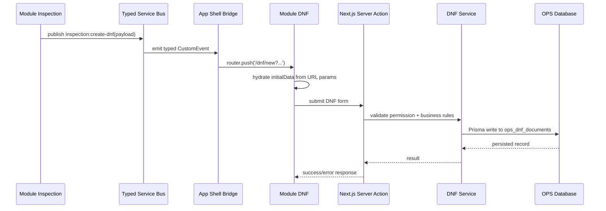
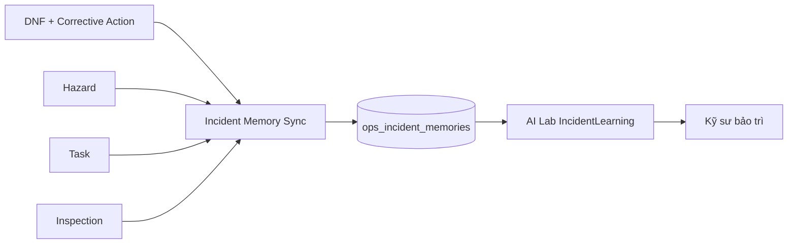

# TÀI LIỆU 1: KIẾN TRÚC HỆ THỐNG CHI TIẾT

## 0. Tóm tắt điều chỉnh kiến trúc

Tài liệu cũ mô tả hệ thống theo hướng **Micro-Frontend (MFE)**. Qua rà soát mã nguồn, cách gọi này chưa thật chính xác ở trạng thái hiện tại vì các module vẫn chạy trong cùng một ứng dụng Next.js, cùng một repository, cùng một runtime và chưa có cơ chế module federation/deployment độc lập.

Mô hình chính xác hơn hiện nay là:

```text
Modular Monolith theo hướng Micro-Frontend-ready
```

Điều này có nghĩa là phần mềm đã được phân rã theo module chức năng, có ranh giới thư mục rõ, có tầng Server Action/Service/Database tách biệt; tuy nhiên chưa phải MFE hoàn chỉnh. Để giảm phụ thuộc chéo giữa các module, hệ thống bổ sung **Typed Cross-Module Service Bus** để các module phát sự kiện và lắng nghe sự kiện thay vì gọi trực tiếp component của nhau.

Các điểm đã cải thiện sau rà soát:

- Bổ sung `src/lib/mfe/service-bus.ts` làm Service Bus typed event.
- Bổ sung `src/components/mfe/cross-module-service-bus-bridge.tsx` để điều phối event cấp app shell.
- Tích hợp Service Bus Bridge vào `src/app/(app)/layout.tsx`.
- Cập nhật `/dnf/new` để nhận dữ liệu khởi tạo từ event Inspection tạo DNF.
- Cập nhật tài liệu để phân biệt rõ phần đã có, điểm yếu còn lại và hướng nâng cấp lên MFE thật.

---

## 1. Mô hình module và luồng dữ liệu xuyên mô-đun

### 1.1. Mô hình hiện tại

Ứng dụng được phân rã thành nhiều module tại:

```text
src/app/(app)/[module]
```

Các module chính gồm: Dashboard, DNF, Hazard, Inspection, Task, Asset 360, AI Lab, Rail Network, GIS/BIM Twin, Spatial Import, Admin, Reports và các phân hệ hỗ trợ khác.

Mỗi module có trách nhiệm riêng về giao diện, form, danh sách, detail page và workflow nghiệp vụ. Dữ liệu không nên truyền trực tiếp bằng cách import component nội bộ giữa các module. Thay vào đó, các module phải đi qua một trong ba lớp sau:

1. **Client Event Bus**: dùng cho điều phối giao diện xuyên module trong cùng phiên làm việc.
2. **Server Action**: dùng cho thao tác có ghi dữ liệu hoặc yêu cầu kiểm tra quyền.
3. **Service Layer**: dùng cho nghiệp vụ backend và truy cập database.

### 1.2. Service Bus xuyên module

Service Bus được đặt tại:

```text
src/lib/mfe/service-bus.ts
```

Service Bus hiện hỗ trợ các event có kiểu rõ ràng:

```text
inspection:create-dnf
dnf:created
hazard:created
asset:open-360
ai-lab:open-incident-learning
```

Điểm quan trọng là các module không tự ý dùng `window.dispatchEvent` rời rạc. Thay vào đó, phải dùng helper typed event như:

```text
publishCreateDnfFromInspection(payload)
subscribeCreateDnfFromInspection(handler)
```

Cách này giúp:

- Giảm lỗi sai tên event.
- Chuẩn hóa payload.
- Dễ bổ sung logging/traceId sau này.
- Giảm phụ thuộc trực tiếp giữa Inspection, DNF, Asset 360 và AI Lab.

### 1.3. Service Bus Bridge

Bridge điều phối event cấp app shell được đặt tại:

```text
src/components/mfe/cross-module-service-bus-bridge.tsx
```

Bridge hiện lắng nghe event:

```text
inspection:create-dnf
```

Khi nhận event, Bridge chuyển hướng sang:

```text
/dnf/new
```

và gắn các tham số cần thiết:

- `originatingInspectionId`
- `originatingFindingId`
- `description`
- `locationOfFailure`
- `staffWhoIdentifiedFailure`
- `equipmentCode`
- `subsystemId`

Trang `/dnf/new` sẽ đọc các tham số này để tự động điền trước form DNF.

---

## 2. Luồng dữ liệu mẫu: tạo DNF từ Inspection

Luồng chuẩn sau khi cải thiện:



Ý nghĩa nghiệp vụ:

1. Kỹ sư phát hiện lỗi trong quá trình Inspection.
2. Module Inspection phát event `inspection:create-dnf` với dữ liệu phát hiện.
3. App Shell Bridge nhận event và mở màn hình tạo DNF.
4. Form DNF tự điền dữ liệu từ Inspection.
5. Khi người dùng gửi form, dữ liệu đi qua Server Action và Service Layer.
6. Dữ liệu được lưu vào OPS database.

---

## 3. Điểm yếu đã phát hiện

### 3.1. Gọi là Micro-Frontend nhưng chưa đủ điều kiện MFE thật

Điểm yếu: tài liệu cũ dùng thuật ngữ MFE nhưng hệ thống chưa có deployment độc lập từng module, chưa có module federation, chưa có version contract giữa module và chưa có runtime isolation.

Cải thiện: tài liệu hiện đổi cách mô tả thành **Modular Monolith theo hướng Micro-Frontend-ready**. Đây là cách gọi chính xác và an toàn hơn cho nghiệm thu kỹ thuật.

### 3.2. Service Bus được mô tả nhưng chưa có hiện thực rõ ràng

Điểm yếu: tài liệu cũ nói có `CustomEvent create-dnf-from-inspection`, nhưng mã nguồn chưa có Service Bus typed event chính thức.

Cải thiện: đã bổ sung Service Bus tại `src/lib/mfe/service-bus.ts` và Bridge tại `src/components/mfe/cross-module-service-bus-bridge.tsx`.

### 3.3. Event name và payload có nguy cơ bị sai lệch

Điểm yếu: nếu từng module tự dùng chuỗi event riêng, dễ phát sinh lỗi sai tên event, thiếu trường dữ liệu hoặc payload không đồng nhất.

Cải thiện: event name và payload đã được định nghĩa bằng TypeScript trong `CrossModuleEventMap`.

### 3.4. Module DNF trước đây chủ yếu nhận dữ liệu qua query string

Điểm yếu: cách truyền query string vẫn chạy được nhưng chưa thể hiện rõ vai trò điều phối xuyên module.

Cải thiện: Service Bus Bridge hiện chuyển event Inspection thành route `/dnf/new` có query params chuẩn; DNF page đọc thêm `equipmentCode` và `subsystemId` để điền form tốt hơn.

### 3.5. Client Event Bus không thay thế backend transaction

Điểm yếu: nếu hiểu nhầm Service Bus frontend là transaction bus backend thì có thể dẫn đến sai thiết kế.

Cải thiện: tài liệu hiện phân định rõ:

- Client Event Bus chỉ dùng cho điều phối UI trong phiên người dùng.
- Server Action và Service Layer mới là nơi xử lý quyền, validate và ghi database.
- Các nghiệp vụ quan trọng không được chỉ dựa vào event frontend.

---

## 4. Tầng Server Action và Service Layer

Các thao tác có ghi dữ liệu hoặc yêu cầu phân quyền phải đi qua Server Action. Ví dụ:

```text
src/lib/actions/dnf.actions.ts
src/lib/actions/incident-learning.actions.ts
src/lib/actions/ai.actions.ts
```

Server Action chịu trách nhiệm:

- kiểm tra đăng nhập;
- kiểm tra quyền;
- chuẩn hóa input;
- gọi service nghiệp vụ;
- trả kết quả an toàn cho client.

Service Layer chịu trách nhiệm nghiệp vụ sâu hơn, ví dụ:

```text
src/lib/services/dnf-service.ts
src/lib/services/task-service.ts
src/lib/services/incident-learning-service.ts
```

Service Layer không nên phụ thuộc vào component UI. Đây là lớp phù hợp để tái sử dụng giữa UI, script CLI, job đồng bộ và API nội bộ.

---

## 5. Kiến trúc AI Core Layer

AI Lab hiện gồm các nhóm chức năng:

1. DocumentRAG: hỏi đáp theo tài liệu PDF/DOCX nội bộ.
2. GraphRAG: phân tích quan hệ giữa thiết bị, DNF, Hazard, Task và tri thức liên quan.
3. IncidentLearning: học từ sự cố tương tự.
4. AI Vision: phân tích hình ảnh khi hạ tầng AI được cấu hình.
5. Agent/NemoClaw: trợ lý hội thoại và cá nhân hóa theo vai trò.

### 5.1. Incident Learning production flow

Incident Learning hiện có kiến trúc production hơn trước:



Các thành phần chính:

```text
prisma/ops/schema.prisma                    -> model IncidentMemory
prisma/ops/migrations/.../migration.sql     -> tạo bảng ops_incident_memories
src/lib/services/incident-learning-service.ts
src/lib/actions/incident-learning.actions.ts
src/scripts/sync-incident-memory.ts
```

Nguyên tắc an toàn:

- AI chỉ đưa ra gợi ý kỹ thuật tham khảo.
- Kết quả phải được đối chiếu với hiện trường, log, tài liệu O&M và phê duyệt an toàn.
- Bài học kinh nghiệm chính thức nên được xác nhận qua trạng thái `verified` trong Incident Memory.

---

## 6. Kiến trúc cơ sở dữ liệu lai

Hệ thống sử dụng nhiều schema/database logic để tách vùng trách nhiệm:

1. `authDb`: người dùng, vai trò, quyền, phiên đăng nhập.
2. `opsDb`: DNF, Hazard, Inspection, Task, Incident Memory.
3. `metroDb`: tuyến, ga, thiết bị, GIS/BIM, Asset Spatial Link.
4. `aiDb`: AI agent, knowledge metadata, TrustGraph hoặc metadata liên quan AI.

Cơ chế fallback/offline cần được hiểu đúng: đây là lớp tăng khả năng phục hồi trong một số tình huống mất kết nối hoặc môi trường test, không phải cam kết hệ thống “bất tử” hoặc luôn đạt 99.9% nếu thiếu hạ tầng HA, backup, monitoring và quy trình khôi phục.

---

## 7. Các giới hạn còn lại

### 7.1. Chưa phải MFE deployment độc lập

Các module chưa thể build/deploy/version độc lập. Muốn trở thành MFE thật cần bổ sung:

- module federation hoặc cơ chế remote module;
- contract version giữa shell và module;
- boundary test cho từng module;
- observability theo module;
- rollback theo module.

### 7.2. Service Bus mới ở mức client runtime

Service Bus hiện dùng `CustomEvent` trong trình duyệt. Cơ chế này phù hợp cho điều phối UI, nhưng không thay thế message broker backend.

Nếu cần workflow liên phòng/đa người dùng/thời gian thực, cần bổ sung:

- database event/outbox pattern;
- queue/broker như Redis Streams, RabbitMQ hoặc Kafka;
- audit log cho event nghiệp vụ;
- retry và dead-letter queue.

### 7.3. Incident Memory cần quy trình phê duyệt

Incident Memory đã có model và sync service, nhưng cần bổ sung UI/quy trình xác nhận để chuyển trạng thái từ `draft` hoặc `reviewed` sang `verified`.

### 7.4. GIS/BIM và Google Maps cần dữ liệu chính thức

Dữ liệu tuyến/ga/GIS/BIM/Google Maps hiện phục vụ kiểm chứng kiến trúc. Trước khi dùng vận hành chính thức cần thay bằng dữ liệu GIS/BIM/As-built/Place ID được phê duyệt.

---

## 8. Tiêu chí nghiệm thu kiến trúc

Có thể nghiệm thu kỹ thuật nội bộ khi:

- `Security and Acceptance Gate` pass.
- `Docker Acceptance Gate` pass.
- `/dnf/new` nhận dữ liệu từ Inspection thông qua Service Bus Bridge.
- AI Lab IncidentLearning đọc được Incident Memory hoặc OPS database.
- Docker build và production smoke test pass.
- Tài liệu kiến trúc không mô tả quá mức năng lực thực tế.

Chưa nghiệm thu production nếu:

- chưa chạy migration chính thức;
- chưa có seed dữ liệu tuyến/ga/GIS/BIM chính thức;
- Incident Memory chưa có quy trình xác nhận bài học kinh nghiệm;
- chưa có monitoring, backup/restore drill và rollback plan.
