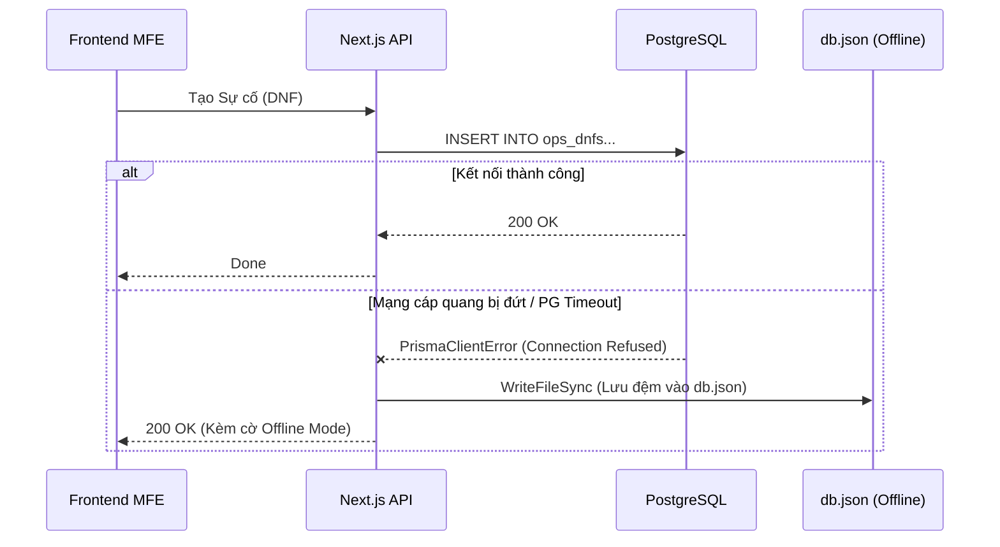

# TÀI LIỆU 1: KIẾN TRÚC HỆ THỐNG CHI TIẾT (SYSTEM ARCHITECTURE DEEP DIVE)

**HURC1 CRM (Metro Inspect Pro)** không chỉ là một phần mềm CRUD (Create-Read-Update-Delete) thông thường. Nó là một cỗ máy xử lý dữ liệu lai (Hybrid Data Engine) kết hợp cùng Trí tuệ nhân tạo (AI) và Kiến trúc Độc lập (Micro-Frontend).

---

## 1. MÔ HÌNH MICRO-FRONTEND (MFE) VÀ LUỒNG DỮ LIỆU (DATA FLOW)

Thay vì đóng gói toàn bộ tính năng vào một khối khổng lồ (Monolith), chúng tôi phân rã ứng dụng thành 12+ Module tại `src/app/(app)/[module]`. 

### 1.1 Sơ đồ Luồng dữ liệu Xuyên Module (Cross-Module Data Flow)
Để duy trì tính độc lập, các Module không nói chuyện trực tiếp với nhau mà thông qua tầng **Dịch vụ Giao dịch (Service Bus)**.

**Ví dụ một luồng xử lý DNF:**
1. **[Module Inspections]:** User phát hiện lỗi khi đang làm bảng kiểm tra định kỳ. Ấn nút "Báo cáo DNF".
2. Hệ thống phát một *CustomEvent* `create-dnf-from-inspection`.
3. **[Module DNF]:** Lắng nghe Event, bật Form tạo DNF, tự động điền sẵn các dữ liệu thiết bị từ Inspection cũ.
4. User ấn Submit. Dữ liệu chạy xuống Next.js Server Action (`dnf.actions.ts`).
5. Server Action gọi tới Prisma ORM, lưu vào CSDL. 

### 1.2 Ưu điểm cốt lõi của kiến trúc này
- **Lỗi không lây lan:** Nếu Module AI Vision bị sập, Module báo cáo Sự cố DNF vẫn hoạt động bình thường.
- **Tách biệt State:** State quản lý bằng React Context / Zustand được khoanh vùng chặt chẽ bên trong thư mục của từng module.

---

## 2. GIẢI PHẪU TẦNG TRÍ TUỆ NHÂN TẠO (AI CORE LAYER)

Tầng AI của HURC1 CRM bao gồm 3 lõi công nghệ chạy hoàn toàn **OFFLINE (Air-Gapped)** để bảo vệ tuyệt đối bí mật hạ tầng kỹ thuật quốc gia.

### 2.1 Lõi Tầm nhìn (Computer Vision - YOLOv8)
Được triển khai bằng Python FastAPI, chạy dưới dạng một container độc lập trong Docker.
- Khi kỹ thuật viên chụp một bức ảnh đường ray bị nứt, file ảnh sẽ được gửi luồng (stream) tới server YOLO.
- Trọng số mô hình (Weights) đã được train riêng cho đường sắt (nhận diện ray nứt, ốc vít lỏng, rỉ sét).
- Trả về tọa độ Bounding Box và Confidence Score. Nếu Confidence > 85%, phần mềm tự cắm cờ (Flag) "Nghi ngờ nghiêm trọng".

### 2.2 Lõi Đọc Hiểu RAG (Retrieval-Augmented Generation)
Sử dụng LLM nội bộ (Ollama) kết hợp Cơ sở dữ liệu Vector (ChromaDB).
- **Vấn đề:** Các sổ tay bảo trì (Maintenance Manuals) là những file PDF dài hàng ngàn trang.
- **Giải pháp:** Khi user tải file PDF lên, hệ thống xé nhỏ (Chunking) thành từng đoạn 500 từ, nhúng (Embed) thành vector, và lưu vào ChromaDB.
- Khi user hỏi: *"Quy trình xử lý cháy tủ điện ga Cát Linh?"*, hệ thống dò vector tìm 3 đoạn PDF liên quan nhất, ném cho Llama3 để tổng hợp thành một đoạn văn ngắn gọn, dễ hiểu kèm trích dẫn trang tài liệu gốc.

### 2.3 Mạng Lưới Niềm Tin (TrustGraph)
Cơ sở dữ liệu biểu đồ (Graph Database) giúp AI hiểu mối quan hệ nhân-quả trong hệ thống Metro.
- Các Node bao gồm: Thiết bị, Sự cố (DNF), Hành động khắc phục.
- Các Edge bao gồm: `CAUSED_BY`, `LOCATED_AT`, `FIXED_BY`.
- **Ví dụ thực tiễn:** Nếu Motor Bơm Nước bị hỏng 5 lần trong tháng. TrustGraph phân tích và tìm ra một điểm chung (Node ẩn): Cả 5 lần đều do Tủ Điện X bị rò điện. Từ đó, AI cảnh báo Lãnh đạo thay vì thay Motor, hãy đại tu Tủ Điện X.

---

## 3. KIẾN TRÚC CƠ SỞ DỮ LIỆU LAI (HYBRID DATABASE ARCHITECTURE) TỐI THƯỢNG

Bảo đảm hệ thống sống sót 99.9% ngay cả khi Server SQL chết.

### 3.1 Thiết kế 4 CSDL Trực tuyến (PostgreSQL)
Thay vì nhồi nhét vào 1 DB, chúng tôi chia thành 4 DB logic, cô lập vùng rủi ro:
1. `authDb`: Lưu Account, Hash Password, Roles. Cực kỳ bảo mật.
2. `opsDb`: Lưu DNF, Inspections, Hazards, Tasks. Tần suất ghi/xóa cực cao.
3. `metroDb`: Lưu cấu trúc Trạm Ga, Thiết bị vật lý, Định mức. Tần suất Đọc cao, Ghi thấp.
4. `aiDb`: Lưu Node/Edge của TrustGraph, Vector DB Metadata.

### 3.2 Lõi Dự phòng Kép (The Fallback Engine)
Thuật toán thần kinh của `src/lib/services/db-wrapper.ts`:

- Cơ chế này biến môi trường của user thành bất tử (Immortal). Họ không bao giờ nhìn thấy lỗi `500 Internal Server Error`.
- Khi mạng có lại, Admin chạy script `npm run migrate`, thuật toán sẽ đối chiếu Timestamp và UUID v4 để bơm ngược dữ liệu từ `db.json` vào Postgres mà không gây trùng lặp (Conflict Resolution).
