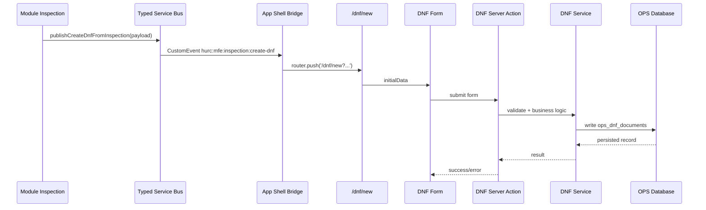
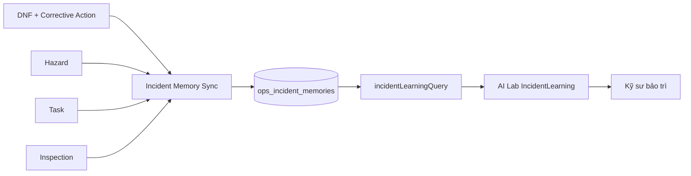

# TÀI LIỆU 1: KIẾN TRÚC HỆ THỐNG CHI TIẾT

## 0. Kết quả đối soát với mã nguồn hiện tại

Tài liệu này đã được rà soát lại với mã nguồn trên nhánh `master`. Kết luận quan trọng nhất là hệ thống hiện **chưa phải Micro-Frontend (MFE) hoàn chỉnh** theo nghĩa có thể build, deploy và version độc lập từng module. Cách mô tả chính xác hơn là:

```text
Modular Monolith theo hướng Micro-Frontend-ready
```

Ứng dụng vẫn chạy trong cùng một Next.js runtime, cùng repository và cùng app shell. Tuy nhiên, phần mềm đã có ranh giới module rõ hơn, có Server Action, Service Layer, nhiều database/schema logic, và đã bổ sung Typed Cross-Module Service Bus để giảm phụ thuộc chéo giữa các module.

Bảng đối soát nhanh:

| Nội dung | Trạng thái thực tế | Kết luận cập nhật |
|---|---|---|
| MFE hoàn chỉnh | Chưa có module federation/deployment độc lập | Gọi là Modular Monolith, Micro-Frontend-ready |
| 12+ module trong `src/app/(app)` | Có nhiều module chức năng trong app shell | Đúng về tổ chức module, chưa đúng nếu hiểu là MFE độc lập |
| Service Bus | Đã có `src/lib/mfe/service-bus.ts` | Đúng, nhưng hiện mới là client event bus |
| Luồng Inspection tạo DNF | Đã có Bridge lắng nghe `inspection:create-dnf` và mở `/dnf/new` | Đúng ở mức điều phối UI |
| Ghi DNF vào DB | Qua DNF form, Server Action/Service và OPS database | Đúng về nguyên tắc backend, cần test theo quyền và dữ liệu thật |
| Incident Learning production | Có model `IncidentMemory`, server action và sync service | Đã có nền production, còn cần migration và quy trình xác nhận bài học |
| Offline/fallback | Có hướng fallback ở một số service | Không được mô tả là bất tử/đảm bảo uptime nếu thiếu HA, backup, monitoring |

---

## 1. Mô hình module hiện tại

Ứng dụng được tổ chức theo module tại:

```text
src/app/(app)/[module]
```

Các module trọng yếu gồm:

- Dashboard;
- DNF;
- Hazard;
- Inspection;
- Task;
- Asset 360;
- AI Lab;
- Rail Network;
- GIS/BIM Twin;
- Spatial Import;
- Admin;
- Reports và các phân hệ hỗ trợ.

Mỗi module chịu trách nhiệm về giao diện, form, danh sách, detail page và workflow nghiệp vụ của chính nó. Các module không nên import trực tiếp component nội bộ của nhau để điều khiển hành vi. Khi cần trao đổi dữ liệu hoặc mở luồng nghiệp vụ giữa module, hệ thống sử dụng một trong ba lớp sau:

1. **Client Event Bus**: điều phối giao diện xuyên module trong cùng phiên người dùng.
2. **Server Action**: xử lý thao tác có ghi dữ liệu, kiểm tra quyền hoặc gọi service backend.
3. **Service Layer**: xử lý nghiệp vụ, chuẩn hóa dữ liệu và truy cập database.

---

## 2. Typed Cross-Module Service Bus

### 2.1. Hiện trạng mã nguồn

Service Bus được triển khai tại:

```text
src/lib/mfe/service-bus.ts
```

File này định nghĩa danh sách event xuyên module:

```text
inspection:create-dnf
dnf:created
hazard:created
asset:open-360
ai-lab:open-incident-learning
```

Các payload được chuẩn hóa trong `CrossModuleEventMap`. Ví dụ event tạo DNF từ Inspection có payload:

```text
originatingInspectionId
originatingFindingId
description
locationOfFailure
staffWhoIdentifiedFailure
equipmentCode
subsystemId
```

Service Bus sử dụng `CustomEvent` trong trình duyệt với prefix:

```text
hurc:mfe:
```

và gắn thêm envelope gồm:

```text
name
payload
emittedAt
traceId
```

Ý nghĩa: thay vì mỗi module tự gọi `window.dispatchEvent` bằng chuỗi rời rạc, các module phải dùng helper typed event như:

```text
publishCrossModuleEvent(...)
subscribeCrossModuleEvent(...)
publishCreateDnfFromInspection(...)
subscribeCreateDnfFromInspection(...)
```

### 2.2. Giới hạn cần hiểu đúng

Service Bus hiện là **client runtime event bus**, phù hợp cho điều phối giao diện trong một phiên làm việc của người dùng. Nó không thay thế:

- database transaction;
- backend message broker;
- audit log nghiệp vụ;
- queue/retry/dead-letter;
- luồng xử lý đa người dùng theo thời gian thực.

Nếu sau này cần Service Bus ở mức backend, nên bổ sung outbox pattern hoặc message broker như Redis Streams, RabbitMQ hoặc Kafka.

---

## 3. App Shell Bridge và luồng tạo DNF từ Inspection

### 3.1. Bridge hiện có

Bridge điều phối xuyên module được triển khai tại:

```text
src/components/mfe/cross-module-service-bus-bridge.tsx
```

Bridge đang lắng nghe event:

```text
inspection:create-dnf
```

Khi nhận event, Bridge tạo query string và điều hướng đến:

```text
/dnf/new
```

Các tham số được truyền gồm:

```text
originatingInspectionId
originatingFindingId
description
locationOfFailure
staffWhoIdentifiedFailure
equipmentCode
subsystemId
```

Bridge đã được gắn vào app shell tại:

```text
src/app/(app)/layout.tsx
```

### 3.2. Trang tạo DNF

Trang tạo DNF tại:

```text
src/app/(app)/dnf/new/page.tsx
```

Trang này đọc các tham số từ URL và hydrate `initialData` cho `DnfForm`, bao gồm:

```text
originatingInspectionId
originatingFindingId
descriptionOfFailure
locationOfFailure
staffWhoIdentifiedFailure
failedComponentEquipmentLRUTrainNumber
subsystemIds
```

Như vậy, luồng `Inspection -> Service Bus -> Bridge -> DNF Form` đã có nền code thật. Tuy nhiên, để luồng chạy đầy đủ, module Inspection cần gọi đúng helper:

```text
publishCreateDnfFromInspection(payload)
```

### 3.3. Sơ đồ luồng dữ liệu đã đối soát



### 3.4. Điểm cần kiểm thử

Khi test server, cần kiểm tra tối thiểu:

1. Từ Inspection bấm tạo DNF hoặc gọi event đúng helper.
2. Ứng dụng tự mở `/dnf/new`.
3. Form DNF tự điền mô tả, vị trí, người phát hiện, mã thiết bị và subsystem nếu có.
4. Submit form không lỗi quyền.
5. DNF được lưu vào OPS database.
6. DNF giữ được `originatingInspectionId` và `originatingFindingId` để truy vết.

---

## 4. Tầng Server Action và Service Layer

Các thao tác có ghi dữ liệu hoặc yêu cầu quyền không được xử lý chỉ bằng Client Event Bus. Phần mềm sử dụng Server Action và Service Layer cho nghiệp vụ backend.

Ví dụ Server Action:

```text
src/lib/actions/dnf.actions.ts
src/lib/actions/incident-learning.actions.ts
src/lib/actions/ai.actions.ts
```

Server Action chịu trách nhiệm:

- kiểm tra đăng nhập;
- kiểm tra quyền;
- chuẩn hóa input;
- gọi service nghiệp vụ;
- trả kết quả an toàn cho client.

Ví dụ Service Layer:

```text
src/lib/services/dnf-service.ts
src/lib/services/task-service.ts
src/lib/services/incident-learning-service.ts
```

Service Layer chịu trách nhiệm:

- nghiệp vụ chuyên sâu;
- chuẩn hóa dữ liệu;
- truy cập Prisma/DB;
- tái sử dụng cho UI, script CLI, job đồng bộ hoặc API nội bộ.

---

## 5. AI Lab và Incident Learning

### 5.1. Các năng lực AI Lab hiện có

AI Lab hiện được tổ chức theo các nhóm chức năng:

1. **DocumentRAG**: hỏi đáp theo PDF/DOCX nội bộ và nguồn tri thức đã chọn.
2. **GraphRAG**: phân tích quan hệ giữa thiết bị, sự cố, mối nguy và tri thức liên quan.
3. **IncidentLearning**: học từ sự cố tương tự để gợi ý phương án xử lý.
4. **AI Vision**: phân tích hình ảnh khi hạ tầng AI được cấu hình.
5. **Agent/NemoClaw**: trợ lý hội thoại và cá nhân hóa theo vai trò.

### 5.2. Incident Learning đã đối soát

Incident Learning hiện có các thành phần:

```text
prisma/ops/schema.prisma                    -> model IncidentMemory
prisma/ops/migrations/.../migration.sql     -> tạo bảng ops_incident_memories
src/lib/services/incident-learning-service.ts
src/lib/actions/incident-learning.actions.ts
src/scripts/sync-incident-memory.ts
```

Server action hiện có:

```text
incidentLearningQuery(query)
syncIncidentMemory()
```

Luồng production dự kiến:



Nguyên tắc an toàn:

- AI chỉ đưa ra gợi ý kỹ thuật tham khảo.
- Kết quả phải được đối chiếu với hiện trường, log, tài liệu O&M và phê duyệt an toàn.
- Bài học kinh nghiệm chính thức nên được xác nhận qua `verificationState = verified` trong Incident Memory.

### 5.3. Điều kiện vận hành Incident Memory

Trước khi dùng Incident Learning ở mức production, cần thực hiện:

```bash
npx prisma migrate deploy --schema=prisma/ops/schema.prisma
npx prisma generate --schema=prisma/ops/schema.prisma
npx tsx src/scripts/sync-incident-memory.ts
```

Sau đó kiểm tra `/ai-lab`, chọn mode `IncidentLearning` và nhập tình huống sự cố để xác nhận nguồn dữ liệu trả về là Incident Memory/OPS database, không chỉ fallback sample.

---

## 6. Kiến trúc dữ liệu

Hệ thống sử dụng nhiều schema/database logic để tách vùng trách nhiệm:

1. `authDb`: người dùng, vai trò, quyền, phiên đăng nhập.
2. `opsDb`: DNF, Hazard, Inspection, Task, Incident Memory.
3. `metroDb`: tuyến, ga, thiết bị, GIS/BIM, Asset Spatial Link.
4. `aiDb`: AI agent, knowledge metadata, TrustGraph hoặc metadata liên quan AI.

Cách chia này giúp giảm rủi ro khi một nhóm dữ liệu có tần suất ghi cao hoặc nhạy cảm hơn các nhóm còn lại. Tuy nhiên, đây không tự động bảo đảm tính sẵn sàng cao. Muốn đạt mức production ổn định cần thêm:

- backup/restore drill;
- migration rollback plan;
- monitoring và alerting;
- log tập trung;
- healthcheck/readiness endpoint;
- quy trình seed dữ liệu chính thức.

---

## 7. Các điểm yếu còn lại sau đối soát

### 7.1. Chưa phải MFE deployment độc lập

Các module chưa thể build, deploy hoặc rollback độc lập. Để trở thành MFE thật cần:

- module federation hoặc remote module;
- contract version giữa shell và module;
- boundary test cho từng module;
- observability theo module;
- rollback theo module.

### 7.2. Service Bus mới điều phối một luồng thật

Service Bus đã định nghĩa nhiều event, nhưng hiện mới xác nhận có Bridge xử lý luồng `inspection:create-dnf`. Các event như `dnf:created`, `hazard:created`, `asset:open-360`, `ai-lab:open-incident-learning` là contract nền, cần tiếp tục nối vào UI/Bridge tương ứng.

### 7.3. Luồng Inspection phát event cần kiểm thử thực tế

Bridge và DNF page đã sẵn sàng, nhưng cần kiểm tra module Inspection có gọi `publishCreateDnfFromInspection(payload)` đúng chỗ hay chưa. Nếu chưa, cần thay các nút tạo DNF từ Inspection sang helper này để thống nhất kiến trúc.

### 7.4. Incident Memory cần quy trình phê duyệt

Đã có model, migration, service sync và server action. Tuy nhiên, cần bổ sung UI/quy trình để kỹ sư hoặc người phụ trách xác nhận bài học kinh nghiệm trước khi chuyển sang `verified`.

### 7.5. GIS/BIM và Google Maps cần dữ liệu chính thức

Dữ liệu tuyến/ga/GIS/BIM/Google Maps hiện phục vụ kiểm chứng kiến trúc. Trước khi dùng vận hành chính thức cần thay bằng dữ liệu GIS/BIM/As-built/Place ID được phê duyệt.

### 7.6. Không mô tả quá mức về uptime/offline

Cơ chế fallback/offline chỉ là lớp hỗ trợ trong một số tình huống. Không được mô tả hệ thống là “bất tử” hoặc bảo đảm 99.9% nếu chưa có hạ tầng HA, backup, monitoring và quy trình khôi phục.

---

## 8. Checklist nghiệm thu kiến trúc

Có thể nghiệm thu kỹ thuật nội bộ khi:

- `Security and Acceptance Gate` pass.
- `Docker Acceptance Gate` pass.
- Build production chạy được.
- Docker container healthy.
- `/dnf/new` nhận dữ liệu khởi tạo từ luồng Inspection.
- AI Lab IncidentLearning đọc được Incident Memory hoặc OPS database.
- Migration `ops_incident_memories` chạy thành công.
- Tài liệu kiến trúc phản ánh đúng mã nguồn và không mô tả quá mức năng lực thực tế.

Chưa nghiệm thu production nếu:

- chưa chạy migration chính thức;
- chưa seed dữ liệu tuyến/ga/GIS/BIM chính thức;
- chưa có quy trình xác nhận Incident Memory;
- chưa có monitoring, backup/restore drill và rollback plan;
- CI/Docker Acceptance còn fail.
