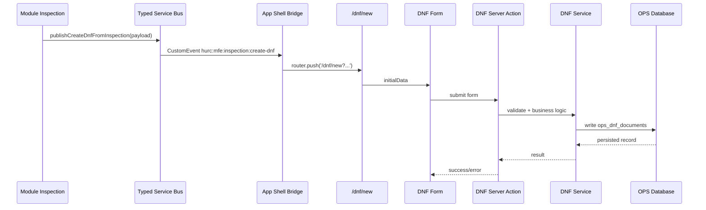
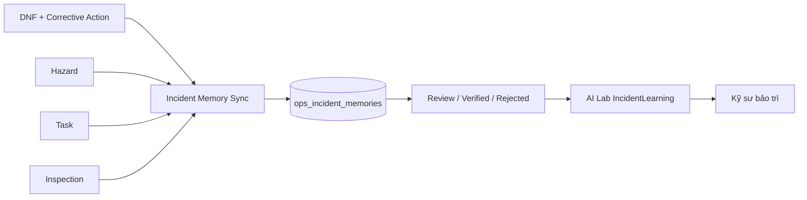

# TÀI LIỆU 1: KIẾN TRÚC HỆ THỐNG CHI TIẾT

## 0. Kết quả đối soát và cải thiện mới nhất

Tài liệu này được đối soát với mã nguồn trên nhánh `master`. Kết luận kiến trúc hiện tại:

```text
Modular Monolith theo hướng Micro-Frontend-ready
```

Hệ thống **chưa phải Micro-Frontend deployment độc lập** vì các module vẫn chạy trong cùng một Next.js runtime, cùng repository và cùng app shell. Tuy nhiên, phần mềm đã được cải thiện để tiến gần MFE-ready hơn thông qua module registry, Service Bus typed event, App Shell Bridge, Server Action, Service Layer và các tài liệu quản trị dữ liệu/độ tin cậy.

Bảng đối soát sau cải thiện:

| Nội dung | Trạng thái sau cải thiện | Ghi chú nghiệm thu |
|---|---|---|
| MFE deployment độc lập | Chưa có | Đã bổ sung module registry và lộ trình MFE-ready |
| Module registry | Đã có `src/lib/mfe/module-registry.ts` | Dùng để khai báo module, route, data boundary và event contract |
| Service Bus | Đã có `src/lib/mfe/service-bus.ts` | Có helper cho Inspection, DNF, Hazard, Asset 360 và AI Lab |
| Bridge điều phối | Đã có `src/components/mfe/cross-module-service-bus-bridge.tsx` | Đã điều phối `inspection:create-dnf`, `asset:open-360`, `ai-lab:open-incident-learning` |
| Inspection tạo DNF | Đã có component event button nền | Cần thay nút legacy trong màn hình Inspection bằng component mới để hoàn tất |
| Incident Memory | Đã có model, sync service, approval service và actions | Cần thêm UI phê duyệt và quyền riêng trước production |
| GIS/BIM/Google Maps | Đã có tài liệu governance | Cần dữ liệu chính thức trước vận hành |
| Uptime/offline | Đã giới hạn lại cách mô tả | Không cam kết HA nếu chưa có hạ tầng HA/backup/monitoring |

---

## 1. Mô hình module hiện tại

Ứng dụng được tổ chức theo module tại:

```text
src/app/(app)/[module]
```

Các module trọng yếu gồm Dashboard, DNF, Hazard, Inspection, Task, Asset 360, AI Lab, Rail Network, GIS/BIM Twin, Spatial Import, Admin, Reports và các phân hệ hỗ trợ.

Mỗi module có trách nhiệm riêng về giao diện, form, danh sách, detail page và workflow nghiệp vụ. Khi cần trao đổi dữ liệu hoặc mở luồng nghiệp vụ giữa module, hệ thống dùng một trong ba lớp:

1. **Client Event Bus**: điều phối giao diện xuyên module trong cùng phiên người dùng.
2. **Server Action**: xử lý thao tác ghi dữ liệu, kiểm tra quyền hoặc gọi service backend.
3. **Service Layer**: xử lý nghiệp vụ, chuẩn hóa dữ liệu và truy cập database.

---

## 2. MFE-ready Module Registry

Đã bổ sung registry tại:

```text
src/lib/mfe/module-registry.ts
```

Registry khai báo contract tối thiểu của từng module:

```text
id
name
routePrefix
owner
runtimeMode
criticality
dataBoundary
allowedInboundEvents
allowedOutboundEvents
productionReadiness
```

Ý nghĩa:

- Làm rõ module nào thuộc dữ liệu nào: `authDb`, `opsDb`, `metroDb`, `aiDb`, `mixed`.
- Làm rõ event nào module được phép nhận/gửi.
- Làm rõ module nào cần dữ liệu chính thức, migration hoặc kiểm thử thêm.
- Tạo nền cho boundary test và tách module sau này.

Tài liệu chi tiết:

```text
docs/mfe_readiness_and_module_boundary_plan.md
```

Lưu ý: registry giúp hệ thống MFE-ready hơn, nhưng không làm hệ thống trở thành MFE deployment độc lập.

---

## 3. Typed Cross-Module Service Bus

Service Bus được triển khai tại:

```text
src/lib/mfe/service-bus.ts
```

Các event đã khai báo:

```text
inspection:create-dnf
dnf:created
hazard:created
asset:open-360
ai-lab:open-incident-learning
```

Các helper chính:

```text
publishCrossModuleEvent(...)
subscribeCrossModuleEvent(...)
publishCreateDnfFromInspection(...)
subscribeCreateDnfFromInspection(...)
publishDnfCreated(...)
publishHazardCreated(...)
publishOpenAsset360(...)
publishOpenIncidentLearning(...)
```

Service Bus sử dụng `CustomEvent` trong trình duyệt với prefix:

```text
hurc:mfe:
```

và envelope gồm `name`, `payload`, `emittedAt`, `traceId`.

### Giới hạn

Service Bus hiện là **client runtime event bus**. Nó không thay thế database transaction, backend message broker, audit log nghiệp vụ, queue/retry/dead-letter hoặc workflow đa người dùng. Nếu cần Service Bus backend, cần bổ sung outbox pattern hoặc broker như Redis Streams/RabbitMQ/Kafka.

---

## 4. App Shell Bridge và các luồng đã nối

Bridge điều phối xuyên module nằm tại:

```text
src/components/mfe/cross-module-service-bus-bridge.tsx
```

Bridge đã được gắn vào app shell tại:

```text
src/app/(app)/layout.tsx
```

Các luồng đã có nền điều phối:

### 4.1. Inspection tạo DNF

```text
inspection:create-dnf -> /dnf/new
```

Payload gồm:

```text
originatingInspectionId
originatingFindingId
description
locationOfFailure
staffWhoIdentifiedFailure
equipmentCode
subsystemId
```

Trang `/dnf/new` đọc tham số và hydrate `DnfForm` với `initialData`.

Đã bổ sung component nền để module Inspection dùng đúng Service Bus:

```text
src/components/inspections/create-dnf-from-finding-event-button.tsx
```

Cần thay nút legacy trong `inspection-detail-client.tsx` bằng component này để hoàn tất 100% luồng Inspection -> Service Bus -> DNF.

### 4.2. Asset 360

```text
asset:open-360 -> /asset-360?assetId=...&assetCode=...&stationId=...
```

Luồng này dùng để các module Rail Network, GIS/BIM hoặc AI Lab mở hồ sơ tài sản 360 độ mà không import trực tiếp component Asset 360.

### 4.3. AI Lab Incident Learning

```text
ai-lab:open-incident-learning -> /ai-lab?mode=incident_learning&query=...
```

Luồng này dùng để các module khác chuyển kỹ sư đến AI Lab với bối cảnh sự cố cần phân tích.

---

## 5. Luồng dữ liệu tạo DNF từ Inspection



Điểm cần test trên server:

- Từ Inspection bấm tạo DNF.
- Ứng dụng mở `/dnf/new`.
- Form DNF tự điền mô tả, vị trí, người phát hiện, mã thiết bị và subsystem nếu có.
- Submit form không lỗi quyền.
- DNF lưu vào OPS database.
- DNF giữ `originatingInspectionId` và `originatingFindingId` để truy vết.

---

## 6. Server Action và Service Layer

Các thao tác ghi dữ liệu hoặc yêu cầu quyền không được xử lý chỉ bằng Client Event Bus. Phần mềm sử dụng Server Action và Service Layer cho nghiệp vụ backend.

Ví dụ Server Action:

```text
src/lib/actions/dnf.actions.ts
src/lib/actions/incident-learning.actions.ts
src/lib/actions/ai.actions.ts
```

Ví dụ Service Layer:

```text
src/lib/services/dnf-service.ts
src/lib/services/task-service.ts
src/lib/services/incident-learning-service.ts
src/lib/services/incident-memory-approval-service.ts
```

Service Layer chịu trách nhiệm nghiệp vụ, chuẩn hóa dữ liệu, truy cập Prisma/DB và tái sử dụng cho UI, script CLI, job đồng bộ hoặc API nội bộ.

---

## 7. AI Lab, Incident Learning và phê duyệt Incident Memory

Incident Learning hiện có các thành phần:

```text
prisma/ops/schema.prisma                    -> model IncidentMemory
prisma/ops/migrations/.../migration.sql     -> tạo bảng ops_incident_memories
src/lib/services/incident-learning-service.ts
src/lib/services/incident-memory-approval-service.ts
src/lib/actions/incident-learning.actions.ts
src/scripts/sync-incident-memory.ts
```

Server actions hiện có:

```text
incidentLearningQuery(query)
syncIncidentMemory()
getIncidentMemoryApprovalQueue(limit)
setIncidentMemoryVerificationState(memoryId, verificationState, verifiedBy)
```

Luồng production:



Tài liệu quy trình phê duyệt:

```text
docs/incident_memory_approval_workflow.md
```

Nguyên tắc an toàn:

- AI chỉ đưa ra gợi ý kỹ thuật tham khảo.
- Kết quả phải được đối chiếu với hiện trường, log, tài liệu O&M và phê duyệt an toàn.
- Bài học kinh nghiệm chính thức nên có `verificationState = verified`.

---

## 8. GIS/BIM và Google Maps

Dữ liệu tuyến/ga/GIS/BIM/Google Maps hiện có một phần là demo/tham khảo để kiểm chứng kiến trúc. Không được dùng nhầm làm dữ liệu vận hành chính thức.

Đã bổ sung tài liệu governance:

```text
docs/official_gis_google_maps_data_governance.md
```

Nguyên tắc:

- `demo`: chỉ dùng để kiểm thử/trình diễn.
- `needs-review`: có nguồn nhưng chưa được xác nhận.
- `official`: đã có nguồn dữ liệu, người xác nhận, ngày xác nhận, tọa độ hoặc Google Place ID hợp lệ.

Trước production cần có dữ liệu GIS/BIM/As-built/Place ID được phê duyệt.

---

## 9. Giới hạn uptime/offline

Cơ chế fallback/offline chỉ là lớp hỗ trợ trong một số tình huống. Không được mô tả hệ thống là “bất tử” hoặc bảo đảm 99.9% nếu chưa có:

- hạ tầng HA;
- backup/restore drill;
- migration rollback plan;
- monitoring và alerting;
- log tập trung;
- readiness/liveness healthcheck;
- quy trình khôi phục sự cố.

---

## 10. Điểm yếu còn lại sau cải thiện

1. Chưa có MFE deployment độc lập.
2. Service Bus đã mở rộng helper và Bridge, nhưng một số event vẫn là contract nền, chưa được nối hết vào UI.
3. Module Inspection đã có component Service Bus button mới, nhưng cần thay nút legacy trong màn hình chi tiết Inspection.
4. Incident Memory đã có service phê duyệt, nhưng chưa có UI quản trị đầy đủ.
5. GIS/BIM và Google Maps cần dữ liệu chính thức.
6. Uptime/offline đã được giới hạn mô tả, nhưng production vẫn cần hạ tầng vận hành thật.

---

## 11. Checklist nghiệm thu kiến trúc

Có thể nghiệm thu kỹ thuật nội bộ khi:

- `Security and Acceptance Gate` pass.
- `Docker Acceptance Gate` pass.
- Build production chạy được.
- Docker container healthy.
- Inspection tạo DNF qua Service Bus.
- AI Lab IncidentLearning đọc được Incident Memory hoặc OPS database.
- Migration `ops_incident_memories` chạy thành công.
- Dữ liệu GIS/BIM/Google Maps được đánh dấu demo/needs-review/official rõ ràng.
- Tài liệu kiến trúc phản ánh đúng mã nguồn và không mô tả quá mức năng lực thực tế.

Chưa nghiệm thu production nếu:

- chưa chạy migration chính thức;
- chưa seed dữ liệu tuyến/ga/GIS/BIM chính thức;
- chưa có UI/quy trình xác nhận Incident Memory;
- chưa có monitoring, backup/restore drill và rollback plan;
- CI/Docker Acceptance còn fail.
