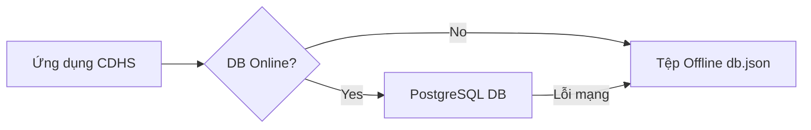

# TÀI LIỆU 1: KIẾN TRÚC HỆ THỐNG TỔNG THỂ (SYSTEM ARCHITECTURE)

**HURC1 CRM (Metro Inspect Pro)** là hệ thống quản trị thông minh được thiết kế đặc biệt cho môi trường đường sắt đô thị. Phần mềm hoạt động độc lập trong môi trường cô lập mạng hoàn toàn (Air-Gapped), đảm bảo an ninh quốc gia và bảo mật dữ liệu tuyệt đối.

---

## 1. MÔ HÌNH KIẾN TRÚC MICRO-FRONTEND (MFE)

Để giải quyết tình trạng nghẽn cổ chai (Frontend Bottleneck) và đảm bảo tính mở rộng cao khi số lượng module nghiệp vụ gia tăng, hệ thống áp dụng kiến trúc Micro-Frontend.

### 1.1 Cấu trúc Module
Kiến trúc chia hệ thống thành các khối độc lập:

```mermaid
graph TD
    User([Người dùng]) --> Shell[Host Shell / Next.js]
    
    subgraph Host Shell [Lớp Vỏ Tích hợp]
        Auth[Auth / RBAC]
        Nav[Routing]
        Layout[Theme Layout]
    end
    
    subgraph Tầng MFE [Tầng Micro-frontends (Remotes)]
        M1[Báo cáo DNF]
        M2[Quản lý Hazards]
        M3[Kiểm tra - Inspections]
        M4[Quản trị AD & Hệ thống]
    end
    
    Shell --> M1
    Shell --> M2
    Shell --> M3
    Shell --> M4
```

### 1.2 Nguyên lý Vận hành MFE
- **Sự độc lập (Independence):** Các module nằm tách biệt trong thư mục `src/app/(app)/[module-name]`.
- **Không khớp nối giao diện (Decoupled):** Tuyệt đối không import chéo Component nghiệp vụ giữa các module (Ngoại trừ UI Kit chung `src/components/ui`).
- **Giao tiếp Sự kiện (Event Bus):** Việc truyền dữ liệu xuyên module bắt buộc phải qua `CustomEvent` của trình duyệt hoặc Service Event Emitter ở Server.

---

## 2. KIẾN TRÚC TẦNG TRÍ TUỆ NHÂN TẠO (AI CORE LAYER)

Trái tim của hệ thống phân tích chiến lược là kiến trúc AI tiên tiến dựa trên nền tảng Offline LLM (Ollama) và Computer Vision (YOLOv8).

### 2.1 Cấu trúc AI Ensemble RAG
- **TrustGraph (Knowledge Graph):** Cấu trúc hóa các mối quan hệ nghiệp vụ giữa Thiết bị - Sự cố - Hành động khắc phục. Giúp AI hiểu được tác động dây chuyền của một linh kiện bị lỗi.
- **DocumentRAG (Vector Search):** Xử lý và truy vấn ngữ nghĩa thông minh các tài liệu quy trình, cẩm nang bảo trì PDF/DOCX.
- **Smart Router:** Bộ định tuyến tự động phân tách ý định của CEO:
  1. *Truy vấn Data trực tiếp (Database).*
  2. *Truy vấn Kiến thức Kỹ thuật (RAG).*
  3. *Hội thoại Thông thường (Chat).*
- **Agent Memory:** Lưu trữ ngữ cảnh trao đổi liên tục để AI nhớ những chỉ đạo và thói quen xem dữ liệu của người dùng.

### 2.2 Quy định Tương tác AI
- **Chế độ Advisory-Only:** AI hoạt động dưới chế độ Cố vấn (Chỉ đọc - Gợi ý). Mọi thao tác Ghi/Cập nhật dữ liệu hệ thống (duyệt biên bản, gán việc) bắt buộc phải do Con người (Người dùng) quyết định và bấm nút xác nhận cuối cùng.

---

## 3. KIẾN TRÚC DỮ LIỆU LAI (HYBRID DATABASE ARCHITECTURE)

Hệ thống sở hữu khả năng **Kháng lỗi tối đa (High Resiliency)**, có khả năng vận hành trơn tru cả khi không có kết nối cơ sở dữ liệu PostgreSQL.

### 3.1 Chế Độ Trực Tuyến (PostgreSQL Online)
Hệ thống sử dụng 4 cơ sở dữ liệu độc lập khi Online:
1. **authDb:** (Xác thực) Tài khoản, Mật khẩu băm, Mã 2FA.
2. **opsDb:** (Vận hành) Danh sách kiểm tra, DNF, Hành động khắc phục.
3. **aiDb:** (AI) Node tri thức TrustGraph, Nhật ký trò chuyện.
4. **metroDb:** (Thiết bị) Tài sản, Trạm ga, Báo cáo đo lường.

### 3.2 Chế Độ Ngoại Tuyến Dự Phòng (JSON Fallback)

- Khi Prisma mất kết nối Postgres, lớp bao bọc **`db-wrapper.ts`** tự động định tuyến toàn bộ API Đọc/Ghi xuống tệp `db.json` nội bộ trong tíc tắc (Transparent Fallback). Giao diện người dùng không hề bị đứng máy hay báo lỗi HTTP 500.

---

## 4. BẢO MẬT VÀ PHÂN QUYỀN (HYBRID RBAC)

Hệ thống kết hợp Phân quyền theo Vai trò (RBAC) và Phân quyền theo Phạm vi Đơn vị (Scope-based Access Control).

### 4.1 Cấu trúc AD Đệ quy (Recursive AD Tree)
Cây tổ chức sử dụng cấu trúc Đơn vị (Organizational Unit - OU) đệ quy. 
- Mọi đơn vị đều là OU và chỉ định cha bằng thuộc tính `parentId`.
- Hỗ trợ **Đơn vị Ảo (Virtual OUs):** Các đơn vị hình thành tự động thông qua Danh mục Nhà ga hoặc Danh mục Phân hệ, giúp Admin không phải nhập liệu 2 lần.

### 4.2 Ma trận Vai trò
- **SUPER_ADMIN:** Quyền tối thượng (`*`).
- **MANAGER:** Quản trị chiến lược, xem báo cáo, giám sát độ tin cậy.
- **ADMIN_PKTAT:** Phân giao công việc, duyệt đại tu, phát sinh hành động khắc phục.
- **L2_TECHNICIAN:** Chỉ xem và xử lý các tác vụ thuộc **Phân hệ kỹ thuật** (Ví dụ: Điện, Ray) mà tài khoản được gán (Scope).
- **L1_OPERATOR:** Tuần tra thực địa, ghi nhận Hazard và DNF sơ cấp.
