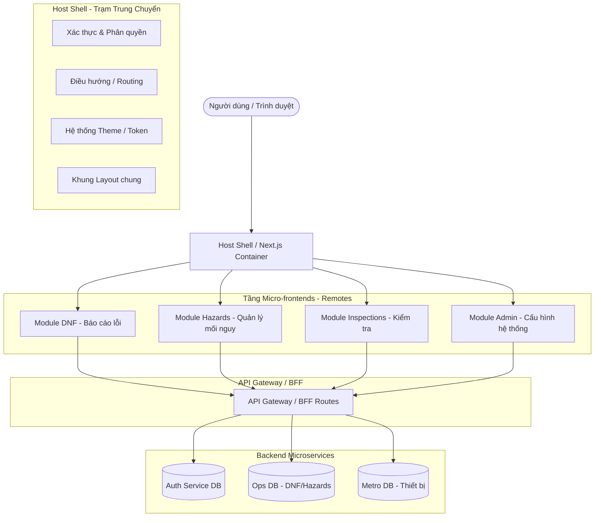

# QUY TẮC THIẾT KẾ HỆ THỐNG - KIẾN TRÚC MICRO-FRONTEND THỜI KỲ VIBE CODE

Tài liệu này định hình tiêu chuẩn thiết kế kiến trúc và phát triển phần mềm cho hệ thống **Hurc1CRM (Metro Inspect Pro)** để chuẩn bị cho giai đoạn mở rộng 2026 - 2027. Tài liệu tập trung giải quyết bài toán nghẽn cổ chai ở tầng giao diện (Frontend Bottleneck) khi tốc độ sinh tính năng tăng đột biến nhờ AI.

---

## 1. Bối Cảnh: Kiến Trúc Phần Mềm Thời Kỳ Vibe Code

Trong thời đại phát triển phần mềm được hỗ trợ mạnh mẽ bởi AI Agent (Vibe Code):
- **Tốc độ sinh mã cực nhanh**: Backend API và các logic nghiệp vụ được tạo ra nhanh chóng. Hệ thống Monolith dễ dàng bị phình to (bloated) và gãy đổ do các xung đột mã nguồn chồng chéo.
- **Nghẽn cổ chai tầng giao diện (Frontend Bottleneck)**: Khi hàng chục hoặc hàng trăm module API sẵn sàng, việc đóng gói chung toàn bộ mã nguồn giao diện vào một Monolithic Frontend duy nhất sẽ gây ra các vấn đề nghiêm trọng về deploy, xung đột UI/Layout (lên tới 30-50% khác biệt giữa các module) và thời gian biên dịch (build time).
- **Môi trường lai tạp tính năng**: Nhu cầu cho phép bên thứ ba hoặc khách hàng tự phát triển tính năng (bằng AI) tích hợp trực tiếp vào hệ thống đòi hỏi một kiến trúc cô lập an toàn.

> [!IMPORTANT]
> **Micro-frontend (MFE)** là kiến trúc **bắt buộc** phải áp dụng để chia tách giao diện thành các phần tử độc lập, giúp hệ thống sẵn sàng cho việc phân phối và deploy tính năng linh hoạt.

---

## 2. Mô Hình Kiến Trúc Micro-frontend (MFE)



### 5 Nguyên Tắc Vàng của Kiến Trúc MFE
1. **Independent Development (Phát triển Độc lập)**: Mỗi module giao diện nằm trong thư mục/repo riêng, có thể được lập trình và nâng cấp độc lập mà không ảnh hưởng tới nhân (Shell) hệ thống.
2. **Scalability on Demand (Mở rộng theo Nhu cầu)**: Các tính năng phức tạp có tải cao được cô lập và chạy trên tài nguyên riêng.
3. **Technology Flexibility (Linh hoạt Công nghệ)**: Cho phép nâng cấp thư viện UI hoặc áp dụng các framework/phiên bản khác nhau cho các module remote mà không cần cập nhật đồng loạt.
4. **Team Autonomy (Tự chủ Đội ngũ)**: Các nhóm phát triển (hoặc các AI Agent khác nhau) chịu trách nhiệm toàn diện từ giao diện đến database của module đó.
5. **Faster Time to Market (Đưa ra thị trường nhanh hơn)**: Rút ngắn thời gian kiểm thử và deploy, cho phép deploy module mới ngay trong ngày mà không cần build lại toàn bộ ứng dụng.

---

## 3. Quy Tắc Kỹ Thuật Cho Hurc1CRM

### 3.1 Cấu Trúc File & Ranh Giới Module
Hệ thống hiện tại được tổ chức theo cấu trúc Next.js App Router. Mọi module phải tuân thủ nghiêm ngặt ranh giới thư mục:
- **Thư mục Module**: Nằm cô lập trong `src/app/(app)/[module-name]` (ví dụ: `dnf`, `hazards`, `inspections`).
- **Giao diện độc lập**: Không được import trực tiếp các file Page/Component nội bộ của module này sang module khác.
- **Shared Components**: Chỉ các component nằm trong `src/components/ui/` (thiết kế nguyên tử như Button, Dialog, Card) mới được dùng chung.

### 3.2 Cơ Chế Giao Tiếp Không Khớp Nối (Decoupled Communication)
Tuyệt đối **CẤM** import chéo state hoặc gọi trực tiếp API của module khác tại Client Component.
- **Giao tiếp tầng Client (Trình duyệt)**: Bắt buộc sử dụng Event Bus tiêu chuẩn thông qua Custom Events.
  ```typescript
  // Trình phát sự kiện (MFE 1)
  window.dispatchEvent(new CustomEvent('hurc:dnf-created', { 
      detail: { dnfId: 'DNF-2026-001' } 
  }));

  // Trình lắng nghe sự kiện (MFE 2 / Shell)
  window.addEventListener('hurc:dnf-created', (e: Event) => {
      const { dnfId } = (e as CustomEvent).detail;
      // Thực hiện phản hồi
  });
  ```
- **Giao tiếp tầng Server**: Sử dụng `@/lib/services/event-emitter` cho các tác vụ bất đồng bộ.

### 3.3 BFF (Backend for Frontend) độc lập
- Mọi MFE phải gọi API thông qua các Route Handler riêng đặt tại `src/app/api/[module-name]/route.ts` hoặc thông qua các **Server Actions** cô lập đặt tại `src/lib/actions/[module-name].ts`.
- Không chia sẻ các hàm truy vấn database thô (Direct Prisma Query) trực tiếp giữa các module. Mọi truy cập dữ liệu chéo phải qua lớp Service bảo vệ.

---

## 4. Quy Tắc Viết Mã Cho AI Agent (Vibe Code Guidelines)

Để ngăn chặn AI tự động tạo ra một bãi rác Monolithic khổng lồ, các quy tắc viết mã sau là bắt buộc:

### 🛡️ Quy Tắc Cô Lập Trạng Thái (Component Isolation)
- **Kích thước file**: Component không được vượt quá 300 dòng mã. Nếu dài hơn, AI bắt buộc phải chia nhỏ thành các Component con hoặc trích xuất logic ra custom hook.
- **Custom Hooks**: Mọi logic gọi API, kiểm thử dữ liệu đầu vào (Zod validation), và quản lý state phức tạp của UI phải nằm trong custom hook (ví dụ: `useDnfForm.ts`), không viết trực tiếp trong file Component giao diện.

### 🛡️ Quy Tắc Thiết Kế Giao Diện Nhất Quán (Design Token Integrity)
- Chỉ sử dụng các Token màu sắc được định nghĩa sẵn trong `tailwind.config.ts` (ví dụ: `primary`, `background`, `accent`).
- Tuyệt đối không hardcode các mã màu ngẫu nhiên (như `bg-[#29ABE2]`, `text-[#F26419]`) trong các component. Phải sử dụng CSS Variable hoặc Tailwind utility class tương ứng để đảm bảo tính đồng bộ khi thay đổi giao diện/theme hệ thống.

### 🛡️ Chế Độ AI Advisory-Only (Chỉ Đọc & Gợi Ý)
- Khi phát triển các tính năng hỗ trợ quyết định bằng AI: AI chỉ được phép đọc dữ liệu, phân tích và đưa ra gợi ý/đề xuất. Quyền ghi, thay đổi trạng thái, hoặc duyệt hồ sơ bảo trì bắt buộc phải do người dùng là con người bấm nút xác nhận cuối cùng để tránh các rủi ro vận hành đường sắt đô thị.

---

*Quy chuẩn thiết kế này được áp dụng tự động cho mọi bản sửa đổi mã nguồn bởi các kỹ sư và AI Agent hỗ trợ.*
