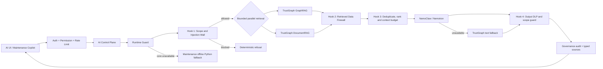

# Secure RAG Hooks Architecture

## Mục tiêu

Liên kết ba thành phần AI hiện có thành một luồng thống nhất và có kiểm soát:

1. TrustGraph DocumentRAG và GraphRAG truy xuất dữ liệu song song.
2. Secure RAG Hooks kiểm tra phạm vi, provenance, prompt injection, dữ liệu nhạy cảm và ngân sách context.
3. NemoClaw/Nemotron sinh câu trả lời từ bằng chứng đã được lọc.
4. Maintenance Copilot sử dụng cùng luồng trung tâm; Python offline RAG chỉ còn là phương án dự phòng khi hạ tầng chính không khả dụng.

## Luồng xử lý



## Thuật toán hooks

### Hook 1 — Scope and Injection Wall

- Chuẩn hóa collection và đối chiếu với allowlist của agent.
- Không cho phép người dùng tự chọn collection ngoài phạm vi agent.
- Băm namespace trước khi truyền sang TrustGraph nhằm cô lập người dùng mà không lộ định danh gốc.
- Chặn yêu cầu ở mức `critical` khi Control Plane đã phát hiện tín hiệu prompt injection.

### Truy xuất song song có giới hạn

- GraphRAG và DocumentRAG chạy bằng `Promise.allSettled`.
- Chỉ có hai nhánh cố định, không tạo fan-out không giới hạn.
- Mỗi nhánh có timeout riêng.
- Lớp Runtime Guard bên ngoài tiếp tục quản lý semaphore theo namespace, single-flight, queue timeout và circuit breaker.

### Hook 2 — Retrieved Data Firewall

- Mọi nội dung truy xuất được xem là dữ liệu không đáng tin, không phải chỉ dẫn.
- Phát hiện các dạng giả mạo system/developer message, special token, jailbreak, ép gọi tool, yêu cầu lộ bí mật hoặc vô hiệu hóa policy.
- Đoạn có nhiều tín hiệu bị quarantine và không được đưa vào prompt.
- Secret, token, password, database URL và private key được che trước khi tạo context.

### Hook 3 — Context Builder

- Khử trùng lặp bằng SHA-256.
- Ưu tiên GraphRAG khi có xung đột, sau đó xét score từ nguồn.
- Giới hạn số bằng chứng và tổng số ký tự.
- Mỗi nguồn được gắn mã `[G#]` hoặc `[D#]`, collection và hash provenance.
- Nemotron chỉ nhận bằng chứng đã qua firewall và được bao trong delimiter `UNTRUSTED_EVIDENCE`.

### Hook 4 — Output Data Loss Prevention

- Chuẩn hóa và giới hạn chiều dài output theo agent profile.
- Che dữ liệu nhạy cảm lần cuối.
- Chặn phản hồi có dấu hiệu lộ immutable policy, system/developer prompt, bearer token hoặc private key.
- Trả kèm danh sách nguồn kiểu hóa và báo cáo bảo mật để phục vụ audit/UI.

## Cơ chế chống vượt phạm vi

- Collection authorization dựa trên `AI_AGENT_REGISTRY`.
- Namespace được tách theo agent, domain và người dùng; giá trị truyền cho retrieval là hash một chiều.
- Bằng chứng không an toàn không được phép tiếp cận mô hình sinh câu trả lời.
- AI chỉ đọc, phân tích và đề xuất; write intent vẫn ở chế độ `advisory-only` và cần con người phê duyệt.
- Maintenance Copilot không còn là một luồng AI độc lập. Nó gọi Secure RAG trung tâm trước và chỉ dùng Python offline khi toàn bộ core không khả dụng.

## Dữ liệu trả về bổ sung

`askWithRAG` vẫn giữ các trường tương thích `response`, `intent`, `source`, đồng thời bổ sung:

- `sources`: ID, loại nguồn, mã tài liệu, phiên bản, trang, collection và hash;
- `security.blocked` và `blockReason`;
- số nhánh retrieval thành công;
- số bằng chứng được chấp nhận/quarantine;
- số lần redaction;
- tín hiệu prompt injection;
- trace thời gian của từng hook.

## Kiểm thử

Chạy:

```bash
npm run test:secure-rag-hooks
```

Bộ kiểm thử xác nhận:

- collection alias hợp lệ và collection ngoài phạm vi bị từ chối;
- tài liệu chứa nhiều chỉ dẫn độc hại bị quarantine;
- password trong tài liệu được che;
- context có giới hạn và nhãn nguồn;
- output có dấu hiệu lộ policy/token bị chặn.
