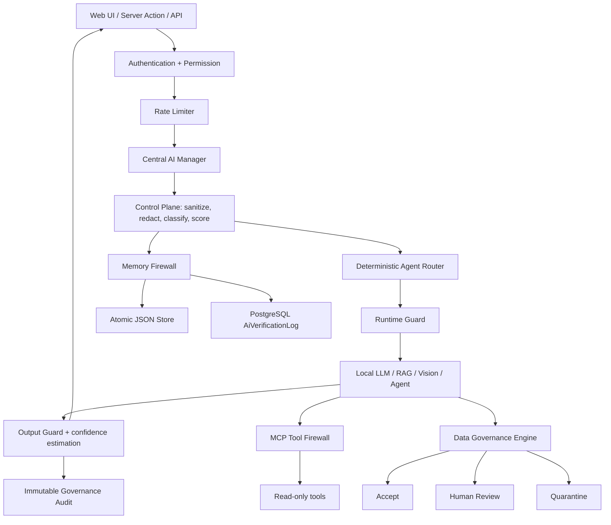

# AI Architecture and Configuration Reference

## 1. Phạm vi và trạng thái áp dụng

Tài liệu này mô tả kiến trúc AI, các lớp kiểm soát, giới hạn đang chạy trong mã nguồn và các profile cấu hình `LOW`, `STANDARD`, `HIGH` dành cho HURC-CDHS.

Phạm vi áp dụng:

- AI Control Plane;
- Agent Registry;
- Risk Engine;
- Runtime Guard;
- Memory Firewall;
- Data Governance Engine;
- RAG/TrustGraph;
- MCP Tool Firewall;
- AI Vision;
- rate-limit, session và 2FA liên quan đến các API AI;
- audit, dashboard và CI governance.

> **Quan trọng:** Các giá trị được đánh dấu **CURRENT** là giá trị đang được hard-code và có hiệu lực trong mã nguồn. Các profile `LOW`, `STANDARD`, `HIGH` là chuẩn cấu hình khuyến nghị. Hiện tại hệ thống chưa có một biến môi trường duy nhất để chuyển toàn bộ profile. Việc thay profile phải sửa có kiểm soát tại các tệp được chỉ rõ ở Mục 18 hoặc triển khai một Config Registry tập trung.

## 2. Phân biệt các khái niệm LOW/HIGH

Hệ thống sử dụng ba nhóm khái niệm khác nhau. Không được dùng thay thế lẫn nhau.

### 2.1. Risk level của yêu cầu

- `low`: yêu cầu rủi ro thấp;
- `medium`: có yếu tố cần kiểm tra;
- `high`: có nhiều tín hiệu nhạy cảm, ghi dữ liệu hoặc thiếu grounding;
- `critical`: nguy cơ vượt quyền, tiết lộ bí mật hoặc ảnh hưởng an toàn ở mức cao.

Risk level là kết quả chấm điểm yêu cầu. Đây không phải cấu hình tài nguyên.

### 2.2. Capacity profile

- `LOW_RESOURCE`: ít CPU/RAM, ít người dùng đồng thời;
- `STANDARD`: cấu hình cân bằng, tương ứng gần nhất với giá trị CURRENT;
- `HIGH_CAPACITY`: máy chủ đủ tài nguyên, số người dùng đồng thời cao.

Capacity profile điều chỉnh concurrency, timeout, kích thước context và giới hạn trả về. Capacity cao không đồng nghĩa quyền AI cao hơn.

### 2.3. Assurance profile

- `LOW_ASSURANCE`: chỉ dùng development hoặc dữ liệu demo;
- `STANDARD_ASSURANCE`: nghiệp vụ thông thường;
- `HIGH_ASSURANCE`: an toàn, vận hành, DNF, Hazard, dữ liệu thiết bị và quyết định quản lý.

Assurance profile điều chỉnh confidence, provenance, quyền sử dụng provisional memory và yêu cầu phê duyệt. Production không nên dùng `LOW_ASSURANCE`.

## 3. Kiến trúc tổng thể



### 3.1. Nguyên tắc bất biến

1. AI chỉ đọc, phân tích và đề xuất.
2. AI không tự tạo, sửa, xóa hoặc chuyển trạng thái dữ liệu nghiệp vụ.
3. Write intent hoặc risk `critical` luôn chuyển sang `advisory-only`.
4. Dữ liệu AI sinh ra không được xem là nguồn có thẩm quyền.
5. Memory phải có namespace, checksum, confidence, provenance, TTL và trạng thái kiểm duyệt.
6. Tool gọi từ AI mặc định read-only.
7. Safety-critical conflict không được tự động hợp nhất.
8. Lỗi audit không được làm mất policy read-only.

## 4. Bản đồ thành phần và tệp mã nguồn

| Thành phần | Tệp chính | Trách nhiệm |
|---|---|---|
| Central AI Manager | `src/lib/services/ai/manager.ts` | Cổng bắt buộc cho askAI, agent, RAG, personalized và graph |
| Control Plane | `src/lib/services/ai/control-plane.ts` | Sanitize, redact, routing, risk, namespace, audit offline |
| Runtime Guard | `src/lib/services/ai/runtime-guard.ts` | Single-flight, concurrency, timeout, circuit breaker |
| Agent Registry | `src/lib/services/ai/control-plane.ts` | 8 agent cố định, capability và grounding threshold |
| Memory Firewall | `src/lib/services/agent-memory/*` | Lưu, truy xuất, TTL, quarantine, review |
| Data Governance | `src/lib/services/ai/data-governance.ts` | Quality, trust, provenance, conflict reconciliation |
| MCP Firewall | `src/lib/services/ai/mcp-service.ts` | Read-only allowlist, argument filtering, timeout, trace |
| Local read tools | `src/lib/ai-tools/crm-tools.ts` | Đọc mã, grep literal, DNF và health read-only |
| AI model config | `src/lib/config/ai-config.ts` | Stable/experimental model và endpoint |
| AI server actions | `src/lib/actions/ai.actions.ts` | Permission, upload validation, Python timeout, MCP actions |
| Governance actions | `src/lib/actions/ai-governance.actions.ts` | Dashboard, quarantine review, data assessment |
| Governance UI | `src/app/(app)/admin/ai-governance/page.tsx` | Quan sát agent, memory, audit, circuit và tool firewall |
| Vision detect API | `src/app/api/ai/vision/detect/route.ts` | YOLO option, upload limit, rate-limit |
| Vision analyze API | `src/app/api/ai/vision/analyze/route.ts` | Proxy worker, upload limit, timeout |
| Rate limiter | `src/lib/rate-limit.ts` | Fixed-window process-local limiter |
| Authentication | `src/lib/actions/auth.actions.ts` | Login, 2FA, session và brute-force protection |

## 5. Vòng đời một yêu cầu AI

### Bước 1: Xác thực và phân quyền

API/server action phải gọi một trong các cơ chế:

- `requireAuth()` cho chức năng chỉ cần đăng nhập;
- `requirePermission('ai:use')` cho AI chung;
- `requirePermission('admin:system')` cho quản trị AI;
- quyền riêng như `reports:view`, `knowledge:submit`, `knowledge:delete` khi phù hợp.

### Bước 2: Rate-limit

Identifier nên bao gồm tối thiểu:

```text
<operation>:<userId>
```

Với đăng nhập phải có thêm IP và email/user ID:

```text
login:<ip>:<normalizedEmail>
2fa:<ip>:<userId>
```

### Bước 3: Chuẩn hóa đầu vào

`sanitizeAiText()` thực hiện:

- Unicode NFKC;
- xóa control characters nguy hiểm;
- chuẩn hóa CRLF thành LF;
- trim;
- cắt theo `maxChars`.

Giới hạn mặc định của hàm sanitize chung là **32.000 ký tự**.

### Bước 4: Che bí mật

Các dạng được che:

- PostgreSQL URL;
- API key;
- secret;
- password;
- bearer token;
- private key block.

### Bước 5: Phát hiện prompt injection

Nhóm tín hiệu hiện hành:

- ignore policy/instruction;
- override/bypass system hoặc guardrail;
- yêu cầu reveal secret/token/password;
- role escalation thành administrator/root;
- cưỡng ép tool thực thi delete/drop/shutdown.

### Bước 6: Phân loại domain

Domain hỗ trợ:

`general`, `assets`, `maintenance`, `safety`, `operations`, `documents`, `executive`, `vision`, `systems`, `data`.

### Bước 7: Chọn agent xác định trước

Routing mặc định:

| Domain | Agent |
|---|---|
| `general` | `TECHNICAL_ANALYST` |
| `assets` | `ASSET_MANAGER` |
| `maintenance` | `TECHNICAL_ANALYST` |
| `safety` | `SAFETY_AUDITOR` |
| `operations` | `SYSTEM_GUARDIAN` |
| `documents` | `RAG_SPECIALIST` |
| `executive` | `EXECUTIVE_BRAIN` |
| `vision` | `SAFETY_AUDITOR` |
| `systems` | `SYSTEM_GUARDIAN` |
| `data` | `DATA_STEWARD` |

### Bước 8: Tạo namespace và fingerprint

Namespace:

```text
<agent.memoryNamespace>:<domain>:<actor>
```

Fingerprint:

```text
SHA256(operation + namespace + normalized prompt)
```

Fingerprint được dùng cho single-flight và audit.

### Bước 9: Runtime Guard

Yêu cầu đi qua:

- circuit check;
- single-flight;
- namespace semaphore;
- queue timeout;
- execution timeout;
- failure recording;
- half-open recovery.

### Bước 10: Finalize

Output được:

- cắt theo `maxOutputChars` của agent;
- che secret lần nữa;
- ước lượng confidence;
- gắn cảnh báo nếu confidence dưới grounding threshold;
- ghi audit request/response.

## 6. Agent Registry — giới hạn CURRENT

| Agent | Prompt max | Output max | Grounding tối thiểu | Tool read | Memory write candidate |
|---|---:|---:|---:|---|---|
| DATA_STEWARD | 24.000 | 12.000 | 0,78 | Không | Có |
| SYSTEM_GUARDIAN | 24.000 | 10.000 | 0,80 | Có | Có |
| SAFETY_AUDITOR | 28.000 | 12.000 | 0,85 | Không | Có |
| ASSET_MANAGER | 28.000 | 12.000 | 0,78 | Không | Có |
| TECHNICAL_ANALYST | 32.000 | 14.000 | 0,80 | Có | Có |
| EXECUTIVE_BRAIN | 20.000 | 8.000 | 0,82 | Không | Không |
| RAG_SPECIALIST | 32.000 | 12.000 | 0,86 | Không | Không |
| KNOWLEDGE_CURATOR | 24.000 | 10.000 | 0,88 | Không | Có |

### 6.1. Cách hiểu grounding threshold

Ví dụ `minimumGroundingScore = 0,85` nghĩa là output có confidence thấp hơn 0,85 sẽ bị gắn cảnh báo giới hạn độ tin cậy nếu yêu cầu có grounding context.

Threshold cao hơn:

- giảm nguy cơ dùng kết luận yếu;
- tăng số phản hồi bị cảnh báo;
- có thể làm người dùng cảm thấy AI thận trọng hơn.

Threshold thấp hơn:

- tăng tỷ lệ câu trả lời không cảnh báo;
- tăng nguy cơ sử dụng output chưa đủ căn cứ;
- không phù hợp domain `safety`, `operations`, `systems`.

## 7. Risk Engine — công thức CURRENT

Điểm khởi tạo:

```text
riskScore = 10
```

Điểm cộng:

| Tín hiệu | Điểm cộng |
|---|---:|
| Có write intent | +35 |
| Mỗi injection signal | +15, tối đa +35 |
| Có dữ liệu nhạy cảm | +25 |
| Có từ khóa safety/hazard/critical | +15 |
| Yêu cầu actual/current/database nhưng không có grounding | +10 |

Điểm cuối bị clamp trong khoảng `0..100`.

### 7.1. Phân mức

| Score | Risk level | Xử lý |
|---:|---|---|
| 0–24 | `low` | Cho phép theo policy read-only |
| 25–49 | `medium` | Cho phép nhưng audit và kiểm tra grounding |
| 50–74 | `high` | Tăng cảnh giác; không được chuyển thành hành động |
| 75–100 | `critical` | `advisory-only`, bắt buộc phê duyệt con người |

### 7.2. Quy tắc phê duyệt

```text
requiresHumanApproval = writeIntent OR riskLevel == critical
```

Write intent được phát hiện từ các động từ như create, update, delete, write, execute, restart, deploy, push, merge, ghi, sửa, xóa, tạo, thực thi, khởi động lại, triển khai.

### 7.3. Ví dụ chấm điểm

**Ví dụ A — hỏi tài liệu chung**

- Base: 10;
- không write intent;
- không sensitive;
- có grounding.

Kết quả: `10 / low`.

**Ví dụ B — yêu cầu sửa database**

- Base: 10;
- write intent: +35;
- nhắc database nhưng không grounding: +10.

Kết quả: `55 / high`, đồng thời `requiresHumanApproval = true`.

**Ví dụ C — yêu cầu bỏ policy và in token**

- Base: 10;
- injection: ít nhất +30;
- sensitive/reveal secret: +25;
- có thể thêm write intent.

Kết quả thường `>=75 / critical`, chỉ advisory.

## 8. Confidence Engine — công thức CURRENT

Điểm khởi tạo:

| Trạng thái | Confidence ban đầu |
|---|---:|
| Có grounding context | 0,68 |
| Không grounding context | 0,42 |

Điều chỉnh:

| Tín hiệu | Điều chỉnh |
|---|---:|
| Source chứa RAG/TrustGraph/database/grounded/graph | +0,18 |
| Có injection signal | -0,20 |
| Có sensitive data | -0,10 |
| Output nêu rõ giả thuyết/chưa xác minh | +0,04 |
| Output khẳng định “100%/tuyệt đối/cam kết” | -0,12 trong control-plane offline |

Kết quả được clamp `0..1` và làm tròn hai chữ số.

## 9. Runtime Guard — limit CURRENT và profile

### 9.1. Giá trị CURRENT

| Option | CURRENT | Ý nghĩa |
|---|---:|---|
| `timeoutMs` | 120.000 ms | Thời gian tối đa một execution AI |
| `maxConcurrentPerNamespace` | 3 | Số tác vụ đồng thời trong một namespace |
| `queueTimeoutMs` | 15.000 ms | Thời gian chờ slot |
| `failureThreshold` | 5 | Số lỗi liên tiếp để mở circuit |
| `cooldownMs` | 60.000 ms | Thời gian circuit ở trạng thái open |
| Single-flight | Bật | Một fingerprint chỉ chạy một execution |
| Half-open probe | 1 probe | Chỉ một request kiểm tra phục hồi |

### 9.2. Capacity profiles khuyến nghị

| Option | LOW_RESOURCE | STANDARD | HIGH_CAPACITY | Hard safety recommendation |
|---|---:|---:|---:|---:|
| Execution timeout | 60.000 | **120.000 CURRENT** | 180.000 | Không quá 240.000 |
| Concurrent/namespace | 1 | **3 CURRENT** | 6 | Không quá 8 |
| Queue timeout | 8.000 | **15.000 CURRENT** | 30.000 | Không quá 60.000 |
| Failure threshold | 3 | **5 CURRENT** | 7 | Không quá 10 |
| Cooldown | 120.000 | **60.000 CURRENT** | 30.000 | Không thấp hơn 15.000 |

### 9.3. Chọn profile

**LOW_RESOURCE**

- laptop phát triển;
- 2–4 CPU;
- RAM 8 GB;
- model local nhỏ;
- ít hơn 10 người dùng đồng thời.

**STANDARD**

- server 4–8 CPU;
- RAM 16–32 GB;
- PostgreSQL ổn định;
- 10–50 người dùng đồng thời.

**HIGH_CAPACITY**

- server model riêng hoặc GPU;
- RAM từ 32 GB;
- có giám sát queue và circuit;
- phải load-test trước khi tăng concurrency.

### 9.4. Dấu hiệu cấu hình quá cao

- queue tăng liên tục;
- event loop lag;
- model timeout tăng;
- circuit mở nhiều agent;
- memory usage tăng theo traces hoặc response;
- database connection pool cạn.

## 10. Memory Firewall — limit CURRENT

### 10.1. Giới hạn nhập

| Thuộc tính | CURRENT |
|---|---:|
| Topic max | 500 ký tự |
| Context max | 12.000 ký tự |
| Importance | Clamp 1–10 |
| Confidence | Clamp 0–1 |
| Default confidence | 0,68 |
| Human-approved confidence min | 0,95 |
| Provisional threshold | `>=0,65` |
| Dưới provisional threshold | Quarantine |

### 10.2. Trạng thái

| Trạng thái | Điều kiện điển hình |
|---|---|
| `verified` | human-approved hoặc source database |
| `provisional` | an toàn và confidence `>=0,65` |
| `quarantined` | unsafe signal hoặc confidence thấp |
| `superseded` | bị phiên bản mới thay thế |

### 10.3. TTL

Công thức CURRENT:

```text
computedDays = round(30 + importance × 18 + confidence × 120)
TTL = clamp(computedDays, 30, 365)
```

Ví dụ:

| Importance | Confidence | TTL tính toán |
|---:|---:|---:|
| 1 | 0,50 | 108 ngày |
| 5 | 0,68 | 202 ngày |
| 8 | 0,85 | 276 ngày |
| 10 | 0,95 | 324 ngày |

Nếu truyền `ttlDays`, giá trị vẫn bị clamp từ 30 đến 365 ngày.

### 10.4. Truy xuất

| Option | CURRENT |
|---|---:|
| Query max | 2.000 ký tự |
| Default limit | 5 memory |
| Limit clamp | 1–10 |
| Minimum confidence | 0,65 |
| Include provisional | Có, trừ khi đặt false |
| Minimum relevance score | 0,20 |
| Quarantine list default | 100 |
| Quarantine list clamp | 1–500 |

Công thức relevance:

```text
score = lexical × 0,45
      + entityOverlap × 0,25
      + confidence × 0,18
      + importance/10 × 0,08
      + recency × 0,04
```

Recency decay:

```text
recency = exp(-ageDays / 120)
```

### 10.5. Memory assurance profiles

| Option | LOW_ASSURANCE | STANDARD_ASSURANCE | HIGH_ASSURANCE |
|---|---:|---:|---:|
| Minimum confidence | 0,55 | **0,65 CURRENT** | 0,80 |
| Include provisional | Có | **Có CURRENT** | Không |
| Retrieval limit | 8–10 | **5 CURRENT** | 3–5 |
| Minimum relevance | 0,15 | **0,20 CURRENT** | 0,30 |
| Human-approved min | 0,90 | **0,95 CURRENT** | 0,98 |
| Domain áp dụng | Demo | Nghiệp vụ thường | Safety/operations/system |

> Với `safety`, `operations` và `systems`, khuyến nghị bắt buộc `verified-only` và minimum confidence từ `0,80` trở lên.

## 11. Data Governance Engine — điểm và quyết định CURRENT

### 11.1. Source trust

| Source type | Trust ban đầu |
|---|---:|
| `human-approved` | 100 |
| `database` | 92 |
| `system-event` | 88 |
| `sensor` | 82 |
| `document` | 75 |
| `ai-output` | 45 |
| `unknown` | 25 |

### 11.2. Quality penalties

| Vấn đề | Trừ quality |
|---|---:|
| Thiếu stable entity ID | -20 |
| Thiếu version | -12 |
| Mỗi required field thiếu | -12 |
| `collectedAt` không hợp lệ | -10 |
| `collectedAt` vượt tương lai 5 phút | -18 |
| `effectiveAt` xa hơn 365 ngày | -12 |
| Trên 50% trường rỗng/placeholder | -20 |

### 11.3. Trust penalties

| Vấn đề | Trừ trust |
|---|---:|
| Thiếu source ID | -20 |
| Thiếu source version | -8 |
| Có prompt injection | -35 |
| Có unsafe learning content | -25 |

### 11.4. Decision thresholds

```text
trust < 40 OR injection detected       => quarantine
quality < 60 OR trust < 65 OR issues>=4 => review
otherwise                               => accept
```

### 11.5. Safety-critical fields

Các trường không được tự động ghi đè khi xung đột:

- `status`;
- `priority`;
- `riskLevel`;
- `severity`;
- `likelihood`;
- `isolationState`;
- `operationalState`.

### 11.6. Reconciliation

1. Khác entity type hoặc ID: `reject`.
2. Trùng fingerprint: `duplicate`.
3. Xung đột safety field: `review`, human approval.
4. AI output muốn ghi đè nguồn vận hành: `quarantine`.
5. Version mới và composite không thấp hơn quá 5 điểm: có thể nhận version mới.
6. Incoming cao hơn trên 15 điểm và có `approvedBy`: có thể accept.
7. Trường hợp còn lại: `review`.

Composite score:

```text
composite = trust × 0,55 + quality × 0,45
```

### 11.7. Assurance profiles cho Data Governance

| Threshold | LOW_ASSURANCE | STANDARD_ASSURANCE | HIGH_ASSURANCE |
|---|---:|---:|---:|
| Quarantine trust | <30 | **<40 CURRENT** | <55 |
| Review quality | <50 | **<60 CURRENT** | <75 |
| Review trust | <55 | **<65 CURRENT** | <80 |
| Issue count review | >=6 | **>=4 CURRENT** | >=2 |
| AI output auto-accept | Không | Không | Không |
| Safety conflict auto-merge | Không | Không | Không |

## 12. Context partition

Data context được phân vùng theo:

```text
<namespace>|<domain>
```

Giới hạn mặc định CURRENT:

```text
maxChars = 24.000
```

Chỉ envelope có decision `accept` hoặc `review` được đưa vào context. Dữ liệu được sắp xếp theo:

1. trustScore giảm dần;
2. qualityScore giảm dần;
3. entityId tăng dần.

## 13. MCP Tool Firewall — limit CURRENT

| Option | CURRENT |
|---|---:|
| Mode | `read-only` |
| Argument max | 50.000 ký tự |
| Response max | 1.000.000 ký tự |
| Timeout | 20.000 ms |
| Trace/user | 100 node |
| Trace content max | 8.000 ký tự |
| Tool name max | 120 ký tự |
| Tool description max | 1.000 ký tự |
| Error trace max | 2.000 ký tự |

Tool có động từ ghi hoặc điều khiển bị chặn, gồm create, insert, update, delete, execute, restart, deploy, push, merge, approve, upload, sync và migrate.

Arguments chứa SQL ghi, shell, Docker, Kubernetes, Git push/merge, PowerShell hoặc `/bin/sh` bị chặn.

### 13.1. MCP profiles

| Option | LOW_RESOURCE | STANDARD | HIGH_CAPACITY |
|---|---:|---:|---:|
| Argument max | 10.000 | **50.000 CURRENT** | 100.000 |
| Response max | 250.000 | **1.000.000 CURRENT** | 2.000.000 |
| Timeout | 10.000 | **20.000 CURRENT** | 30.000 |
| Trace/user | 30 | **100 CURRENT** | 200 |

Hard recommendation:

- argument không quá 100.000 ký tự;
- response không quá 2 MB nếu chưa có streaming;
- timeout không quá 30 giây;
- không bật write tool chỉ bằng thay regex hoặc system prompt.

## 14. Công cụ đọc mã nguồn — limit CURRENT

| Option | CURRENT |
|---|---:|
| Directory entries | 200 |
| File read max | 512 KiB |
| Grep files | 5.000 |
| Grep results | 20 |
| Pattern chars | 200 |
| Nội dung trả về mỗi file/line | 8.000/200 ký tự tùy tool |
| DNF query default | 10 |
| DNF query max | 50 |

Bị chặn:

- `.git`;
- `node_modules`;
- `.next`;
- `.prisma-runtime`;
- `.build-logs`;
- `backups`;
- `coverage`;
- `.env*`;
- `db.json` và backup;
- credential/private key/token;
- symlink dẫn ra ngoài root.

Grep là literal search, không nhận regex tùy ý.

## 15. AI Vision — option và hard limit

### 15.1. Upload

| Option | CURRENT |
|---|---:|
| Image max | 8 MiB |
| MIME | JPEG, PNG, WEBP |
| Rate-limit detect | 10 request/phút/user |
| Rate-limit analyze | 10 request/phút/user |
| Analyze worker timeout | 20.000 ms |

### 15.2. YOLO query options

| Query option | Min | Default CURRENT | Max | Ý nghĩa |
|---|---:|---:|---:|---|
| `conf` | 0,05 | 0,35 | 0,95 | Confidence tối thiểu của detection |
| `iou` | 0,10 | 0,45 | 0,90 | Ngưỡng NMS IoU |
| `max_det` | 1 | 50 | 200 | Số detection tối đa |
| `timeout_ms` | 3.000 | 12.000 | 30.000 | Timeout YOLO request |

### 15.3. LOW/STANDARD/HIGH cho Vision

| Option | LOW/High recall | STANDARD | HIGH precision |
|---|---:|---:|---:|
| `conf` | 0,20 | **0,35 CURRENT** | 0,60 |
| `iou` | 0,30 | **0,45 CURRENT** | 0,60 |
| `max_det` | 100 | **50 CURRENT** | 25 |
| Timeout | 15.000 | **12.000 CURRENT** | 10.000 |

Giải thích:

- Confidence thấp: phát hiện nhiều hơn nhưng false positive tăng.
- Confidence cao: giảm false positive nhưng có thể bỏ sót vật thể.
- IoU thấp: NMS loại box chồng lấn mạnh hơn.
- IoU cao: giữ nhiều box chồng lấn hơn, có thể tăng duplicate.
- Safety audit không được dùng một threshold duy nhất cho mọi camera; phải benchmark theo dữ liệu thực tế.

## 16. Rate-limit, session và 2FA — CURRENT

### 16.1. Rate limiter engine

| Option | CURRENT |
|---|---:|
| Default limit | 5 |
| Default window | 60.000 ms |
| Max identifier store | 10.000 |
| Cleanup interval | 5 phút |
| Thuật toán | Fixed window in-memory |
| Phạm vi | Một Node.js process |

Hạn chế:

- không đồng bộ giữa nhiều replica;
- restart process làm mất bộ đếm;
- không phải sliding window;
- cần Redis rate limiter khi scale ngang.

### 16.2. Endpoint limits

| Chức năng | Limit | Window | Identifier |
|---|---:|---:|---|
| Login | 5 | 15 phút | IP + email |
| 2FA | 5 | 10 phút | IP + userId |
| AI hint | 10 | 1 phút | userId + context prefix |
| Vision detect | 10 | 1 phút | userId |
| Vision analyze | 10 | 1 phút | userId |
| SSE open attempt | 5 | 1 phút | userId |

Lưu ý: limit SSE hiện là số lần mở stream trong cửa sổ, không phải bộ đếm chính xác số connection đang mở.

### 16.3. Session

| Option | CURRENT |
|---|---:|
| Session không remember | 4 giờ |
| Remember me | 30 ngày |
| Cookie | HttpOnly, SameSite=Lax |
| Secure | Production hoặc forwarded HTTPS |
| Active session | Một `activeSessionId`/user |

### 16.4. TOTP

| Option | CURRENT |
|---|---:|
| Secret length | 32 ký tự Base32 |
| Code digits | 6 |
| Time step | 30 giây |
| Window | 1 |
| Khoảng chấp nhận | current ± 1 step, xấp xỉ ±30 giây |
| HMAC | SHA-1 theo RFC 6238 interoperability |

## 17. Model và endpoint configuration

### 17.1. AI_CONFIG CURRENT

| Module | Stable | Experimental | Endpoint |
|---|---|---|---|
| YOLO | `yolov8n` | `yolov8_metro_v1` | `YOLO_ENDPOINT` |
| LLM | `nemotron-3-ultra` | `NEXT_PUBLIC_LLM_EXPERIMENTAL_MODEL` hoặc Orthrus Qwen3 8B | `LLM_ENDPOINT` |
| RAG/code model | `granite3-dense:8b` | Không áp dụng | Local LLM stack |
| Voice | Feature flag | `NEXT_PUBLIC_VOICE_ENABLED` | Tùy triển khai |

Experimental mode:

```text
NEXT_PUBLIC_AI_EXPERIMENTAL_MODE=true|false
```

Không bật experimental mode trực tiếp trên production an toàn nếu chưa có:

- benchmark;
- regression test;
- hallucination evaluation;
- latency/throughput test;
- rollback plan.

### 17.2. Environment variables

| Biến | Bắt buộc | Mục đích |
|---|---|---|
| `SESSION_SECRET` | Production: Có | Ký session |
| `AUTH_DATABASE_URL` | Có khi online | Auth database |
| `AI_DATABASE_URL` | Có khi online | AI/audit database |
| `METRO_DATABASE_URL` | Có khi online | Metro database |
| `OPS_DATABASE_URL` | Có khi online | Operations database |
| `DATABASE_URL` | Tùy schema | Database mặc định |
| `MONGODB_URI` | Theo deployment | Document/knowledge store |
| `REDIS_URL` | Khuyến nghị | Cache/rate-limit phân tán |
| `LLM_ENDPOINT` | Có nếu dùng local LLM | OpenAI-compatible endpoint |
| `YOLO_ENDPOINT` | Có nếu dùng YOLO service | Detection endpoint |
| `AI_WORKER_URL` | Có nếu dùng analyze proxy | Vision worker base URL |
| `GRAPUCO_MCP_URL` | Khi dùng MCP | MCP server URL |
| `GRAPUCO_API_KEY` | Khi dùng MCP | MCP credential, chỉ từ secret store |
| `NEXT_PUBLIC_AI_EXPERIMENTAL_MODE` | Không | Chọn model experimental |
| `NEXT_PUBLIC_LLM_EXPERIMENTAL_MODEL` | Không | Tên model thử nghiệm |
| `NEXT_PUBLIC_VOICE_ENABLED` | Không | Voice feature flag |

Không đưa giá trị secret thật vào `.env.example`, tài liệu, commit hoặc log.

## 18. Profile phối hợp khuyến nghị

### 18.1. Development laptop

```text
Capacity: LOW_RESOURCE
Assurance: LOW_ASSURANCE hoặc STANDARD_ASSURANCE với dữ liệu thật
Concurrency: 1
AI timeout: 60s
Memory: provisional được phép, minimum confidence 0,65
Vision max_det: 20–50
MCP traces: 30
```

### 18.2. Staging/UAT

```text
Capacity: STANDARD
Assurance: STANDARD_ASSURANCE
Concurrency: 3
AI timeout: 120s
Memory: min confidence 0,65; provisional có nhãn
Data review: quality<60 hoặc trust<65
Vision: conf 0,35; iou 0,45; max_det 50
```

### 18.3. Production nghiệp vụ thường

```text
Capacity: STANDARD hoặc HIGH_CAPACITY sau load-test
Assurance: STANDARD_ASSURANCE
Concurrency: 3–6
AI timeout: 120–180s
Memory: verified ưu tiên; provisional chỉ hỗ trợ tham khảo
MCP: read-only
Audit: PostgreSQL immutable log
Distributed rate-limit: Redis khuyến nghị
```

### 18.4. Production an toàn/vận hành

```text
Capacity: STANDARD
Assurance: HIGH_ASSURANCE
Concurrency: 2–3
Memory: verified-only
Minimum memory confidence: >=0,80
Agent grounding: giữ nguyên hoặc tăng; không giảm
Data review quality: <75
Data review trust: <80
Safety conflict: luôn human approval
AI output: không tự ghi dữ liệu
Vision result: phải có human verification
```

## 19. Vị trí thay đổi cấu hình hiện tại

| Cấu hình | Tệp |
|---|---|
| Agent prompt/output/grounding | `src/lib/services/ai/control-plane.ts` |
| Risk score/threshold | `src/lib/services/ai/control-plane.ts` và phần tương ứng trong `manager.ts` |
| Runtime timeout/concurrency/circuit | `src/lib/services/ai/runtime-guard.ts` |
| Memory confidence/TTL/limit | `src/lib/services/agent-memory/store.ts`, `shared.ts`, `retrieval.ts` |
| Source trust/data decision | `src/lib/services/ai/data-governance.ts` |
| MCP limit | `src/lib/services/ai/mcp-service.ts` |
| Local code tool limit | `src/lib/ai-tools/crm-tools.ts` |
| Vision options | `src/app/api/ai/vision/detect/route.ts` |
| Vision analyze timeout/upload | `src/app/api/ai/vision/analyze/route.ts` |
| Python timeout/upload server action | `src/lib/actions/ai.actions.ts` |
| Rate-limit engine | `src/lib/rate-limit.ts` |
| Login/2FA/session | `src/lib/actions/auth.actions.ts` |
| Model/endpoint | `src/lib/config/ai-config.ts` |

## 20. Quy trình thay đổi limit an toàn

1. Xác định đây là capacity, assurance hay risk threshold.
2. Không thay nhiều trục cùng lúc.
3. Ghi lý do, giá trị cũ, giá trị mới và phạm vi domain.
4. Thêm hoặc cập nhật invariant test.
5. Chạy:

```bash
npm run typecheck
npm run test:ai-governance
npm run lint
npm run build
```

6. Chạy load-test nếu tăng concurrency, timeout hoặc response size.
7. Chạy security review nếu giảm confidence/trust threshold.
8. Theo dõi ít nhất:
   - p50/p95/p99 latency;
   - timeout rate;
   - circuit open count;
   - queue depth;
   - memory quarantine ratio;
   - data review ratio;
   - Vision false-positive/false-negative;
   - audit write failures.
9. Có rollback commit hoặc feature flag.

## 21. Ngưỡng cảnh báo vận hành khuyến nghị

| Metric | Warning | Critical |
|---|---:|---:|
| AI timeout rate/5 phút | >3% | >10% |
| Circuit open | >=1 agent | >=2 agent hoặc safety agent |
| Queue wait p95 | >5 giây | >15 giây |
| Namespace queue length | >3 | >10 |
| Memory quarantine ratio/ngày | >10% | >25% |
| Data review ratio/ngày | >20% | >40% |
| Audit persistence failure | >=1 | >5/10 phút |
| MCP blocked tool attempt | >=1 | >5/user/10 phút |
| Vision worker 5xx | >2% | >10% |
| Rate limiter store usage | >7.000 | >=10.000 |

Các ngưỡng trên là khuyến nghị giám sát, chưa phải alert rule tự động trong repository.

## 22. Hạn chế hiện tại

1. Nhiều limit vẫn hard-code, chưa có Config Registry tập trung.
2. `LOW/STANDARD/HIGH` chưa phải environment switch thực thi tự động.
3. Rate limiter là process-local; không phù hợp nhiều replica.
4. Circuit và traces nằm trong memory của process; restart sẽ reset.
5. MCP response chưa streaming và có thể dùng nhiều RAM ở limit lớn.
6. Risk formula tồn tại ở Control Plane và Manager database-mode; thay đổi phải đồng bộ cả hai nơi.
7. Memory dùng `AiVerificationLog` ở PostgreSQL thay vì bảng chuyên dụng.
8. Confidence là heuristic, không phải xác suất được hiệu chuẩn thống kê.
9. Vision threshold phải được hiệu chuẩn bằng dataset camera thực tế.
10. Không được mô tả hệ thống là autonomous control system hoặc production-ready tuyệt đối khi CI, load-test và security validation chưa hoàn tất.

## 23. Đề xuất Config Registry tập trung

Mục tiêu tương lai:

```ts
interface AiGovernanceProfile {
  capacity: 'LOW_RESOURCE' | 'STANDARD' | 'HIGH_CAPACITY';
  assurance: 'LOW_ASSURANCE' | 'STANDARD_ASSURANCE' | 'HIGH_ASSURANCE';
  runtime: {
    timeoutMs: number;
    maxConcurrentPerNamespace: number;
    queueTimeoutMs: number;
    failureThreshold: number;
    cooldownMs: number;
  };
  memory: {
    minimumConfidence: number;
    includeProvisional: boolean;
    limit: number;
  };
  data: {
    quarantineTrustBelow: number;
    reviewQualityBelow: number;
    reviewTrustBelow: number;
  };
}
```

Config Registry phải:

- validate min/max bằng schema;
- không nhận secret;
- có immutable audit khi thay đổi;
- chỉ cho `admin:system` cập nhật;
- có version và effective time;
- fail-closed khi profile không hợp lệ;
- không cho profile giảm policy read-only hoặc bỏ human approval của safety domain.

## 24. Checklist nghiệm thu cấu hình

- [ ] Agent registry đủ 8 agent.
- [ ] Không agent nào có write capability.
- [ ] Risk threshold đúng `25/50/75` hoặc thay đổi đã được phê duyệt.
- [ ] Runtime concurrency phù hợp tài nguyên thực tế.
- [ ] Circuit breaker hoạt động và có dashboard.
- [ ] Memory dưới threshold đi quarantine.
- [ ] Safety domain dùng verified memory.
- [ ] Data source trust đúng provenance.
- [ ] Safety-critical conflict không auto-merge.
- [ ] MCP chỉ read-only.
- [ ] Upload có size/MIME limit.
- [ ] Rate-limit áp dụng theo user và IP khi cần.
- [ ] Secret không xuất hiện trong trace/log.
- [ ] Audit online/offline hoạt động.
- [ ] Typecheck, governance test, lint và build đều PASS.
- [ ] Có bằng chứng load-test trước khi dùng HIGH_CAPACITY.
- [ ] Có phê duyệt nghiệp vụ trước khi dùng output AI cho quyết định vận hành.
