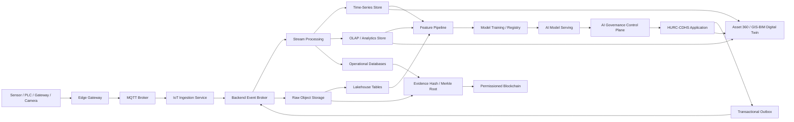

# AI, Big Data, IoT and Blockchain Target Architecture

## 1. Mục đích và trạng thái áp dụng

Tài liệu này xác lập kiến trúc đích để HURC-CDHS phát triển từ hệ thống quản trị nghiệp vụ và Digital Twin hiện tại thành nền tảng dữ liệu – trí tuệ hợp nhất cho vận hành, bảo trì và an toàn đường sắt đô thị.

Bốn trụ cột được định hướng gồm:

1. **Internet vạn vật (IoT):** thu thập dữ liệu thiết bị, môi trường và trạng thái vận hành;
2. **Dữ liệu lớn (Big Data):** tiếp nhận, chuẩn hóa, lưu trữ và phân tích dữ liệu khối lượng lớn;
3. **Trí tuệ nhân tạo (AI):** phát hiện bất thường, dự báo, hỗ trợ chẩn đoán và ra quyết định;
4. **Chuỗi khối (Blockchain):** neo bằng chứng, xác nhận tính toàn vẹn và chia sẻ chứng cứ giữa các tổ chức.

> **Trạng thái:** Đây là kiến trúc đích và lộ trình triển khai. Lần cập nhật này chưa thêm MQTT broker, Kafka/Redpanda, lakehouse, stream processor hoặc blockchain node vào runtime. Các thành phần chỉ được triển khai theo từng giai đoạn sau khi có yêu cầu dữ liệu, kiểm thử tải, đánh giá bảo mật và phương án rollback.

## 2. Hiện trạng nền tảng

Hệ thống hiện có các nền tảng phù hợp để mở rộng:

- Modular Monolith theo hướng Micro-Frontend-ready;
- Module Registry và Typed Client Service Bus;
- PostgreSQL, MongoDB và Redis;
- AI Governance, Memory Firewall, Data Governance và Runtime Profile;
- AI Vision, RAG/TrustGraph và AI Lab;
- Asset 360, GIS/BIM và Digital Twin;
- audit hash-chain, Loki và Grafana;
- Docker Compose theo profile `core`, `ai`, `obs` và `tools`.

Các thành phần còn thiếu:

- backend event broker có durability, retry và dead-letter;
- MQTT/IoT gateway và quản lý danh tính thiết bị;
- time-series database cho telemetry;
- data lake/lakehouse và OLAP store;
- stream processing và feature pipeline;
- model registry/MLOps đầy đủ;
- permissioned ledger cho bằng chứng liên tổ chức.

Typed Service Bus hiện tại chỉ điều phối giao diện trong cùng phiên trình duyệt. Nó không thay thế message broker backend, outbox, queue, retry hoặc workflow đa người dùng.

## 3. Nguyên tắc kiến trúc

1. **IoT tạo dữ liệu; Big Data quản lý dữ liệu; AI tạo insight; Blockchain chứng minh tính toàn vẹn.**
2. Không dùng blockchain làm nơi lưu telemetry, ảnh, video hoặc tài liệu dung lượng lớn.
3. Dữ liệu nghiệp vụ chính vẫn nằm trong PostgreSQL và các kho dữ liệu chuyên dụng.
4. Mọi sự kiện phải có schema version, event ID, asset ID, source, timestamp và quality flag.
5. AI chỉ đọc, phân tích và đề xuất; quyền ghi tiếp tục bị khóa theo AI Governance.
6. Lệnh điều khiển thiết bị không đi trực tiếp từ AI đến thiết bị.
7. Dữ liệu thô phải được giữ nguyên trong vùng immutable trước khi làm sạch.
8. Mỗi luồng ingestion phải hỗ trợ idempotency, retry, dead-letter và audit.
9. Mọi khóa thiết bị, khóa ledger và secret phải nằm trong secret store/KMS, không ghi trong repository.
10. Tăng quy mô theo số liệu tải thực tế, không triển khai cluster lớn ngay từ đầu.

## 4. Kiến trúc tổng thể



## 5. Phân lớp chức năng

### 5.1. Edge và IoT

Nhiệm vụ:

- kết nối cảm biến và hệ thống hiện trường;
- chuyển đổi protocol;
- chuẩn hóa timestamp và đơn vị đo;
- đệm dữ liệu khi mất mạng;
- xác thực thiết bị;
- ký hoặc gắn checksum cho gói dữ liệu;
- gửi telemetry và event lên MQTT.

Protocol ưu tiên:

- MQTT 3.1.1/5.0;
- HTTPS;
- Modbus TCP/RTU qua gateway;
- OPC UA;
- SNMP;
- RS-485;
- LoRaWAN khi phù hợp;
- ONVIF/RTSP chỉ cho metadata và video pipeline chuyên dụng.

Không để ứng dụng Next.js kết nối trực tiếp PLC, RS-485 hoặc sensor.

### 5.2. IoT ingestion

Nhiệm vụ:

- xác thực topic và device identity;
- kiểm tra schema;
- chống replay;
- chống duplicate;
- gắn ingestion timestamp;
- bổ sung quality flag;
- ghi raw event;
- phát sự kiện vào backend broker.

Topic mẫu:

```text
hurc/<environment>/<line>/<station>/<subsystem>/<assetId>/telemetry
hurc/<environment>/<line>/<station>/<subsystem>/<assetId>/event
hurc/<environment>/<line>/<station>/<subsystem>/<assetId>/health
```

Không gửi secret, thông tin cá nhân hoặc file lớn trong MQTT payload.

### 5.3. Backend event backbone

Event backbone phục vụ luồng bền vững giữa các service và module backend.

Lựa chọn theo quy mô:

- LOW: Redis Streams hoặc NATS JetStream;
- STANDARD: Redpanda hoặc Kafka;
- HIGH: Kafka/Redpanda cluster đa node, schema registry và stream processor riêng.

Yêu cầu bắt buộc:

- transactional outbox từ PostgreSQL;
- consumer group;
- idempotency key;
- retry policy;
- dead-letter topic;
- replay có kiểm soát;
- schema compatibility;
- trace ID xuyên suốt.

### 5.4. Big Data storage

Mô hình lưu trữ đề xuất:

| Loại dữ liệu | Kho chính | Mục đích |
|---|---|---|
| Nghiệp vụ giao dịch | PostgreSQL | DNF, Hazard, Inspection, Task, Asset |
| Telemetry nóng | TimescaleDB hoặc tương đương | Truy vấn theo thời gian, cảnh báo gần thời gian thực |
| Phân tích OLAP | ClickHouse hoặc tương đương | KPI, aggregation, phân tích nhiều tỷ bản ghi |
| Dữ liệu thô | MinIO/S3-compatible object storage | Raw telemetry, file, ảnh, model artifact |
| Lakehouse | Iceberg/Delta/Hudi trên object storage | Batch analytics, history và schema evolution |
| Cache/state | Redis | Cache, distributed rate-limit, ephemeral state |
| Metadata AI | PostgreSQL/AI DB | Model, feature, run, provenance, approval |

Không dùng MongoDB hoặc PostgreSQL như kho duy nhất cho telemetry tần suất cao nếu tải đã vượt khả năng đã kiểm chứng.

### 5.5. Stream processing

Stream processing thực hiện:

- window aggregation;
- outlier detection;
- unit conversion;
- data quality scoring;
- enrichment theo asset/subsystem/station;
- stateful correlation;
- cảnh báo theo rule;
- tạo feature gần thời gian thực.

Lựa chọn:

- LOW: worker Node.js/Python hoặc Redis Stream consumer;
- STANDARD: Kafka Streams hoặc Redpanda consumer service;
- HIGH: Apache Flink hoặc Spark Structured Streaming.

### 5.6. AI và MLOps

AI được chia thành bốn lớp:

1. **Rule/Statistics:** threshold, trend, SPC, anomaly cơ bản;
2. **Machine Learning:** dự báo hỏng hóc, phân loại lỗi, remaining useful life;
3. **Computer Vision:** phát hiện vật cản, PPE, nứt, cháy, bất thường hiện trường;
4. **Generative AI/RAG:** hỏi đáp tài liệu, phân tích DNF/Hazard, tổng hợp bằng chứng.

MLOps cần bổ sung:

- dataset version;
- feature definition;
- experiment tracking;
- model registry;
- approval state;
- model signature;
- deployment history;
- drift monitoring;
- rollback model;
- human verification cho kết quả an toàn.

Công cụ có thể lựa chọn:

- MLflow cho experiment/model registry;
- Feast hoặc feature service nội bộ khi có nhu cầu online feature;
- MinIO cho artifact;
- existing AI Governance làm cổng inference và policy.

### 5.7. Blockchain

Blockchain chỉ nên dùng cho các trường hợp nhiều bên cần xác minh một bằng chứng mà không phụ thuộc hoàn toàn vào một database trung tâm.

Use case phù hợp:

- neo hash báo cáo nghiệm thu;
- neo hash nhật ký bảo trì;
- chứng nhận hiệu chuẩn thiết bị;
- bàn giao hồ sơ giữa chủ đầu tư, tư vấn, nhà thầu và đơn vị vận hành;
- chứng minh ảnh/file chưa bị thay đổi;
- ghi nhận approval đa tổ chức;
- chain-of-custody cho bằng chứng sự cố.

Không phù hợp:

- lưu telemetry từng giây;
- lưu ảnh/video;
- lưu dữ liệu cá nhân;
- thay PostgreSQL;
- điều khiển thiết bị;
- dùng token/cryptocurrency trong nghiệp vụ nội bộ.

Mô hình đề xuất:

```text
Operational data / file
→ canonicalization
→ SHA-256
→ Merkle tree theo batch
→ Merkle root
→ permissioned ledger transaction
→ lưu transaction ID ngược về database
```

Dữ liệu thật nằm off-chain. Ledger chỉ lưu hash, metadata tối thiểu, version, signer và timestamp.

Công nghệ tham khảo:

- Hyperledger Fabric cho consortium permissioned;
- Besu/Quorum khi cần EVM permissioned;
- không dùng public blockchain cho dữ liệu vận hành nội bộ khi chưa có phê duyệt pháp lý và bảo mật.

## 6. Event contract chuẩn

Mọi event backend nên dùng envelope thống nhất:

```json
{
  "eventId": "uuid",
  "eventType": "telemetry.received",
  "schemaVersion": "1.0.0",
  "occurredAt": "2026-07-13T00:00:00.000Z",
  "ingestedAt": "2026-07-13T00:00:00.200Z",
  "source": {
    "type": "iot-device",
    "id": "device-id",
    "gatewayId": "gateway-id"
  },
  "asset": {
    "assetId": "asset-id",
    "subsystem": "PSD",
    "station": "BEN-THANH"
  },
  "quality": {
    "status": "good",
    "clockSkewMs": 50,
    "duplicate": false
  },
  "traceId": "trace-id",
  "payload": {}
}
```

Quy tắc:

- `eventId` bất biến;
- timestamp dùng UTC ISO-8601;
- `schemaVersion` bắt buộc;
- payload không vượt hard limit;
- consumer không được phụ thuộc field chưa có trong schema;
- thay đổi breaking phải tăng major version;
- dữ liệu nhạy cảm phải được phân loại trước khi publish.

## 7. Profile triển khai LOW / STANDARD / HIGH

### 7.1. LOW — Proof of Concept

Dùng cho một depot, một ga hoặc số lượng thiết bị nhỏ.

| Thành phần | Cấu hình đề xuất |
|---|---|
| MQTT | Mosquitto một node |
| Event backbone | Redis Streams hoặc NATS JetStream |
| Telemetry | PostgreSQL + TimescaleDB |
| Object storage | MinIO một node |
| Analytics | PostgreSQL/Timescale aggregate |
| AI | Existing local AI + batch Python |
| Blockchain | Chưa triển khai; dùng hash-chain nội bộ |
| Ingestion mục tiêu | đến khoảng 100 message/giây |
| MQTT payload | khuyến nghị ≤64 KiB, hard limit 256 KiB |
| Hot retention | 7–30 ngày |
| Raw retention | 90 ngày |

### 7.2. STANDARD — Production nghiệp vụ

Dùng cho nhiều ga, nhiều subsystem và tải trung bình.

| Thành phần | Cấu hình đề xuất |
|---|---|
| MQTT | EMQX cluster nhỏ hoặc broker HA |
| Event backbone | Redpanda/Kafka 3 node |
| Schema | Schema Registry |
| Telemetry | TimescaleDB HA |
| OLAP | ClickHouse |
| Object storage | MinIO distributed |
| Stream | Kafka consumer/Kafka Streams |
| AI/MLOps | MLflow + governed model serving |
| Blockchain | POC permissioned cho evidence anchoring |
| Ingestion mục tiêu | đến khoảng 5.000 message/giây |
| MQTT payload | khuyến nghị ≤64 KiB, hard limit 512 KiB |
| Hot retention | 30–90 ngày |
| Raw retention | 1–2 năm theo chính sách |

### 7.3. HIGH — Enterprise / Multi-line

Chỉ triển khai sau load-test và đánh giá hạ tầng.

| Thành phần | Cấu hình đề xuất |
|---|---|
| MQTT | EMQX cluster đa vùng hoặc tương đương |
| Event backbone | Kafka/Redpanda cluster, rack awareness |
| Stream | Flink/Spark Structured Streaming |
| Telemetry | TimescaleDB cluster hoặc time-series platform chuyên dụng |
| OLAP | ClickHouse cluster |
| Lakehouse | Object storage cluster + Iceberg/Delta |
| AI/MLOps | Feature store, registry, canary, drift monitoring |
| Blockchain | Consortium ledger đa tổ chức + KMS/HSM |
| Ingestion mục tiêu | 50.000 message/giây trở lên sau benchmark |
| MQTT payload | khuyến nghị ≤64 KiB, hard limit 1 MiB |
| Hot retention | 90–180 ngày |
| Raw retention | theo quy định lưu trữ, tối đa nhiều năm |

Các con số trên là mục tiêu thiết kế, không phải cam kết hiệu năng. Phải benchmark bằng payload, số thiết bị và pattern truy vấn thực tế.

## 8. Bảo mật IoT và dữ liệu

### 8.1. Device identity

- mỗi thiết bị có identity riêng;
- dùng certificate hoặc credential riêng, không dùng mật khẩu chung;
- hỗ trợ revoke;
- rotation định kỳ;
- gateway không được giả danh nhiều thiết bị nếu không có mapping được phê duyệt.

### 8.2. Transport security

- TLS 1.2 trở lên;
- mTLS cho gateway và broker khi triển khai production;
- topic ACL;
- giới hạn kết nối và publish rate;
- chống replay bằng timestamp/nonce khi cần;
- mạng IoT tách VLAN/zone khỏi mạng quản trị.

### 8.3. Data governance

- data classification;
- provenance;
- quality score;
- schema validation;
- retention policy;
- encryption at rest;
- immutable raw zone;
- audit read/write;
- quyền truy cập theo subsystem và vai trò.

### 8.4. AI safety

- AI không phát lệnh điều khiển thiết bị;
- prediction không tự động đóng DNF/Hazard;
- cảnh báo safety phải có nguồn và confidence;
- model mới phải qua approval;
- model drift phải tạo warning;
- ảnh/video phải tuân thủ chính sách riêng tư và lưu trữ.

### 8.5. Blockchain security

- khóa ký trong KMS/HSM;
- node identity riêng;
- endorsement policy;
- channel/private data khi cần;
- key rotation và certificate revocation;
- không ghi PII hoặc secret lên ledger;
- có quy trình khôi phục node và backup metadata off-chain.

## 9. Mapping vào HURC-CDHS

| Module hiện tại | Hướng mở rộng |
|---|---|
| Dashboard | real-time KPI, stream lag, device health, anomaly |
| DNF | tự động gợi ý DNF từ anomaly nhưng bắt buộc người duyệt |
| Hazards | correlation từ sensor, weather, inspection và DNF |
| Inspections | nhận telemetry snapshot và evidence hash |
| Asset 360 | time-series, model health, RUL, maintenance history |
| Rail Network | topology enrichment cho event |
| GIS/BIM Twin | spatial telemetry overlay và alert heatmap |
| AI Lab | feature analysis, model explanation, incident learning |
| Admin | device registry, schema registry, model registry, ledger status |
| Reports | data lineage, evidence verification và audit export |

Module mới dự kiến:

- `/iot` — Device Registry, Gateway, Topic, Telemetry Health;
- `/data-platform` — pipeline, schema, lag, dead-letter, retention;
- `/mlops` — dataset, experiment, model, deployment, drift;
- `/evidence-ledger` — hash verification, anchor transaction và signer.

Các module mới phải được đăng ký trong Module Registry trước khi tạo route production.

## 10. Cấu trúc repository đích

```text
src/
  app/(app)/
    iot/
    data-platform/
    mlops/
    evidence-ledger/
  lib/
    contracts/
      events/
      telemetry/
    services/
      iot/
      streaming/
      data-platform/
      mlops/
      evidence-ledger/
    config/
      data-platform-profile.ts
infra/
  mqtt/
  broker/
  timeseries/
  clickhouse/
  object-storage/
  mlflow/
  ledger/
docs/
  technical/
  adr/
```

Không đưa toàn bộ logic vào `src/lib/services/*.ts` đơn lẻ. Mỗi miền phải có module, contract và boundary rõ ràng.

## 11. Lộ trình triển khai

### Giai đoạn 0 — Governance và contract

Mục tiêu:

- xác định use case ưu tiên;
- inventory thiết bị;
- chuẩn asset ID;
- event envelope;
- data classification;
- retention;
- threat model;
- ADR chọn broker, time-series và object storage.

Điều kiện hoàn thành:

- có schema versioning;
- có data owner;
- có security owner;
- có benchmark plan;
- có rollback plan.

### Giai đoạn 1 — IoT foundation

Mục tiêu:

- triển khai MQTT POC;
- device registry;
- gateway identity;
- ingestion API;
- raw event store;
- TimescaleDB;
- dashboard device health;
- dead-letter và replay.

Use case nên chọn:

- cảm biến mưa;
- nhiệt độ/độ ẩm tủ thiết bị;
- điện áp/dòng điện giám sát;
- vibration/condition monitoring thử nghiệm;
- trạng thái thiết bị có sẵn qua SNMP/OPC UA.

Không bắt đầu bằng điều khiển từ xa.

### Giai đoạn 2 — Big Data platform

Mục tiêu:

- backend broker;
- transactional outbox;
- object storage;
- schema registry;
- OLAP;
- stream aggregation;
- data quality;
- lineage;
- observability.

Điều kiện chuyển giai đoạn:

- không mất dữ liệu trong bài kiểm tra broker restart;
- duplicate được xử lý idempotent;
- replay không làm ghi trùng;
- đo được p95 ingestion latency;
- đo được consumer lag;
- backup/restore đạt yêu cầu.

### Giai đoạn 3 — AI/MLOps

Mục tiêu:

- feature pipeline;
- model registry;
- anomaly detection;
- predictive maintenance;
- model explanation;
- drift monitoring;
- human approval workflow;
- canary/rollback.

Use case ưu tiên:

1. anomaly telemetry;
2. dự báo xu hướng hỏng;
3. correlation DNF – inspection – telemetry;
4. Vision hỗ trợ kiểm tra;
5. RAG tổng hợp bằng chứng.

### Giai đoạn 4 — Blockchain evidence ledger

Chỉ triển khai khi có ít nhất hai tổ chức cần cùng xác minh bằng chứng.

Mục tiêu:

- canonical evidence package;
- Merkle batching;
- permissioned ledger POC;
- signer identity;
- verification UI;
- revocation và recovery;
- legal/security review.

Không triển khai blockchain trước khi quy trình bằng chứng và quyền ký được phê duyệt.

## 12. KPI và SLO đề xuất

| Nhóm | Chỉ số |
|---|---|
| IoT | online device ratio, disconnect rate, message loss, clock skew |
| Broker | throughput, p95 latency, consumer lag, dead-letter rate |
| Data quality | valid schema ratio, duplicate ratio, missing field ratio |
| Storage | ingest rate, query p95, compression ratio, retention usage |
| AI | precision, recall, false alarm, drift, human acceptance rate |
| MLOps | deployment success, rollback time, model age, unapproved model count |
| Blockchain | anchor success, verification success, signer error, ledger lag |
| Security | invalid certificate, ACL denial, replay attempt, secret exposure |

Không đặt SLO production trước khi có baseline đo tải thực tế.

## 13. Anti-pattern cần tránh

- thêm Kafka chỉ vì thuật ngữ Big Data;
- dùng blockchain để lưu mọi bản ghi;
- đưa AI vào vòng điều khiển thiết bị không có con người;
- xây data lake nhưng không có data catalog và owner;
- lưu telemetry không có asset ID/schema version;
- dùng một credential chung cho toàn bộ gateway;
- dùng `latest` image trong production không pin digest/version;
- ingest dữ liệu nhưng không có retention và chi phí lưu trữ;
- tạo model nhưng không có registry, approval và rollback;
- phát sự kiện không có idempotency key;
- xem dashboard đẹp là bằng chứng hệ thống đã production-ready.

## 14. Quyết định khuyến nghị trước mắt

1. Bắt đầu bằng **IoT + Time-Series + Data Governance**, chưa bắt đầu bằng blockchain.
2. Chọn một use case POC có dữ liệu rõ ràng và rủi ro thấp.
3. Dùng `STANDARD/STANDARD` cho AI trong POC; production safety cân nhắc `STANDARD/HIGH`.
4. Dùng PostgreSQL/TimescaleDB và MQTT broker nhỏ trước khi thêm Kafka/ClickHouse.
5. Chỉ thêm Kafka/Redpanda khi cần durability, replay và throughput mà giải pháp nhỏ không đáp ứng.
6. Chỉ thêm ClickHouse khi truy vấn OLAP lớn đã có số liệu chứng minh.
7. Chỉ thêm blockchain khi có yêu cầu xác minh đa tổ chức.
8. Mọi thành phần mới phải có healthcheck, metrics, backup, restore, security baseline và CI acceptance.

## 15. Tiêu chí nghiệm thu kiến trúc

Một giai đoạn chỉ được đánh dấu hoàn thành khi có:

- code và cấu hình đã merge;
- schema và contract đã version;
- unit/integration test;
- load-test phù hợp;
- security review;
- backup/restore test;
- observability dashboard;
- runbook;
- rollback test;
- tài liệu Linux/Windows hoặc Docker;
- CI/CD xanh;
- bằng chứng dữ liệu thật hoặc dữ liệu mô phỏng được ghi rõ.
