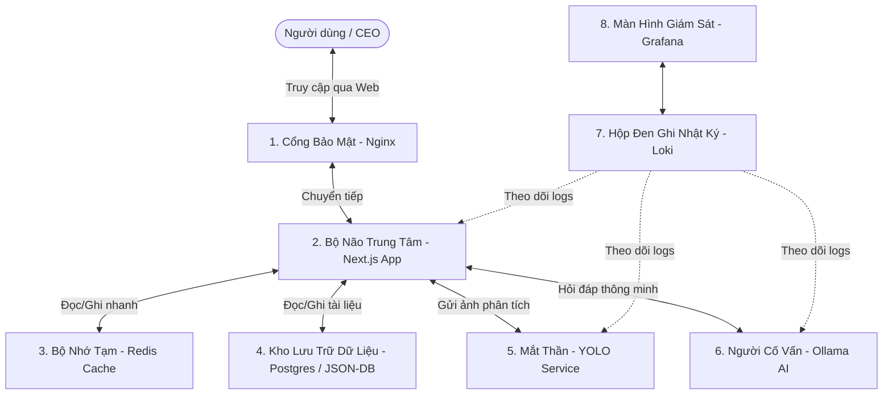

# CẨM NANG TOÀN THƯ VỀ HỆ THỐNG HURC1 CRM VÀ METRO INSPECT PRO

## Dành cho người mới bắt đầu - Từ không biết gì đến làm chủ hệ thống

Chào mừng bạn đến với tài liệu hướng dẫn sử dụng, cài đặt, vận hành và sửa chữa hệ thống **HURC1 CRM** (kèm ứng dụng kiểm tra bảo trì **Metro Inspect Pro**).

Tài liệu này được viết với ngôn ngữ **siêu dễ hiểu, trực quan**, sử dụng các hình ảnh ẩn dụ thực tế. Cho dù bạn là một người hoàn toàn không biết gì về công nghệ, lập trình hay máy tính, chỉ cần đọc và làm theo từng bước trong cẩm nang này, bạn chắc chắn sẽ hiểu và tự tay vận hành, xử lý được mọi tình huống của hệ thống.

---

### 🗺️ BẢN ĐỒ KHÁM PHÁ - MỤC LỤC

1. **HIỂU VỀ PHẦN MỀM (Phần mềm này để làm gì?)**
2. **CÁC TÍNH NĂNG CHÍNH (Phần mềm làm được những gì?)**
3. **KHÁM PHÁ "HỆ SINH THÁI" (Từng mảnh ghép bên trong làm nhiệm vụ gì?)**
4. **HƯỚNG DẪN CÀI ĐẶT TỪ A ĐẾN Z (Cho người chưa từng lập trình)**
5. **CẨM NANG SỬA CHỮA & KHẮC PHỤC SỰ CỐ (Khi có lỗi thì làm sao?)**
6. **HƯỚNG DẪN SAO LƯU & PHỤC HỒI DỮ LIỆU (Bảo vệ thông tin an toàn)**

---

## 1. HIỂU VỀ PHẦN MỀM VÀ CÔNG DỤNG

### 1.1. Câu chuyện thực tế

Hãy tưởng tượng bạn đang quản lý **Tuyến tàu điện ngầm Metro số 1 (HURC1)** của Thành phố Hồ Chí Minh. Mỗi ngày có hàng trăm chuyến tàu chạy, hàng ngàn thiết bị (ray tàu, hệ thống điện, đầu máy, nhà ga, camera...) cần được kiểm tra để đảm bảo an toàn tuyệt đối cho người dân.

- Làm sao Ban giám đốc (CEO) biết được hôm nay có bao nhiêu sự cố? Hệ thống có đang an toàn không?
- Làm sao các nhân viên kỹ thuật đi kiểm tra đường ray có thể ghi nhận lỗi nhanh chóng, chụp ảnh và báo cáo ngay lập tức?
- Làm sao hệ thống vẫn hoạt động mượt mà khi máy chủ **bị mất Internet** hoặc đặt trong môi trường tuyệt mật không được kết nối mạng bên ngoài (môi trường **Air-Gapped**)?

**HURC1 CRM** và **Metro Inspect Pro** chính là câu trả lời! Đây là một hệ thống phần mềm quản lý và trợ lý ảo thông minh, giúp theo dõi toàn bộ trạng thái hoạt động, ghi nhận sự cố bảo trì của hệ thống Metro, chạy hoàn toàn nội bộ và cực kỳ an toàn.

### 1.2. Giải thích các khái niệm kỹ thuật bằng hình ảnh thực tế

Để giúp bạn dễ hình dung, dưới đây là bảng so sánh các từ ngữ chuyên ngành phức tạp sang các hình ảnh đời thường:

| Thuật ngữ chuyên ngành | Giải thích siêu dễ hiểu bằng hình ảnh đời thường |
| :--- | :--- |
| **Air-Gapped (Môi trường cô lập)** | Giống như một **căn phòng bí mật không có cửa sổ và cửa ra vào kết nối với thế giới bên ngoài**. Không ai từ ngoài có thể đột nhập vào được, và dữ liệu bên trong cũng không thể bay ra ngoài. Cực kỳ an toàn trước hacker. |
| **Server (Máy chủ)** | Giống như **ngôi nhà trung tâm**. Nơi chứa tất cả máy móc, dữ liệu và là nơi phần mềm chạy liên tục ngày đêm để phục vụ bạn. |
| **Database (Cơ sở dữ liệu)** | Giống như **tủ hồ sơ** hoặc một cuốn sổ cái khổng lồ ghi chép mọi thông tin (tên nhân viên, lịch trình tàu, các sự cố phát hiện...). |
| **Docker / Container** | Giống như **thùng hàng Container** trên tàu biển. Phần mềm được đóng gói gọn gàng trong thùng này. Khi mang sang máy tính khác, chỉ cần bê nguyên chiếc thùng này đặt vào là chạy ngay, không cần cài đặt lặt vặt. |
| **Port (Cổng)** | Giống như **các số phòng** trong ngôi nhà máy chủ. Mỗi phòng sẽ làm một dịch vụ khác nhau (ví dụ: phòng 80 là phòng tiếp khách xem trang web, phòng 5432 là phòng chứa tài liệu...). |
| **AI RAG (Trí tuệ nhân tạo tra cứu)** | Giống như việc **học sinh đi thi được mang tài liệu**. Thay vì AI tự bịa ra câu trả lời (ảo giác), AI sẽ mở đúng cuốn sách quy trình bảo trì Metro ra đọc, rồi trả lời cho bạn một cách chính xác 100%. |

---

## 2. CÁC TÍNH NĂNG CHÍNH VÀ ĐẶC ĐIỂM NỔI BẬT

Hệ thống được thiết kế nhắm vào hai đối tượng sử dụng chính: **Ban lãnh đạo (CEO)** và **Nhân viên vận hành/Kỹ sư bảo trì**.

### 2.1. Dashboard chỉ số tối cao cho CEO (CEO Executive Dashboard)

Đây là màn hình trang chủ sang trọng dành riêng cho người quản lý cao nhất. Chỉ cần nhìn lướt qua 3 giây, CEO sẽ nắm được toàn bộ "sức khỏe" của tuyến Metro:

- **Health Score (Điểm Sức Khỏe Metro):** Được chấm theo thang điểm 100. Điểm càng cao chứng tỏ hệ thống tàu chạy càng an toàn, ít sự cố.
- **Hazard Map (Bản Đồ Rủi Ro):** Hiển thị trực quan nhà ga nào, trạm nào đang có nhiều lỗi nhất và mức độ khẩn cấp (Đỏ - Nghiêm trọng, Vàng - Cảnh báo, Xanh - An toàn).
- **Strategic Scorecard (Bảng Điểm Chiến Lược):** Đánh giá hiệu suất làm việc của các đội bảo trì xem họ có sửa chữa đúng tiến độ hay không.

#### 📊 Công thức tính toán các chỉ số tối cao cho CEO

Để đảm bảo các con số hiển thị trên Dashboard của CEO hoàn toàn chính xác và mang ý nghĩa thực tế, hệ thống chạy một công cụ tính toán tự động dựa trên các công thức toán học có trọng số như sau:

##### A. Điểm Sức Khỏe Metro (Health Score)

Điểm Sức Khỏe Metro là một chỉ số tổng hợp phản ánh toàn diện ba khía cạnh sống còn của hệ thống đường sắt đô thị: Khả năng giải quyết sự cố phát sinh, Năng lực phòng ngừa nguy hiểm, và Tính ổn định của đội ngũ nhân sự vận hành.

Công thức tính toán có trọng số:

$$\text{Health Score} = (\text{Tỉ lệ Phục hồi Dịch vụ} \times 40\%) + (\text{Tỉ lệ Xử lý Mối nguy} \times 40\%) + (\text{Tỉ lệ Giữ chân Nhân sự} \times 20\%)$$

Giải thích chi tiết từng cấu phần trong công thức:

###### 1. Tỉ lệ Phục hồi Dịch vụ (Service Recovery Rate - Trọng số 40%)

*Ý nghĩa:* Đánh giá tốc độ và hiệu quả của việc khắc phục sự cố kỹ thuật (DNF) phát sinh trên tuyến Metro.

*Công thức tính toán:*

$$\text{Tỉ lệ Phục hồi Dịch vụ} = \left( \frac{\text{Số sự cố DNF đã giải quyết}}{\text{Tổng số sự cố DNF phát sinh}} \right) \times 100$$

*Lưu ý kỹ thuật:* Các sự cố DNF được coi là "đã giải quyết" khi trạng thái của chúng là **"Đóng"** hoặc **"Hoàn thành"**. Nếu hệ thống hoàn toàn không có sự cố nào phát sinh, tỉ lệ này mặc định đạt tối đa **100%**.

###### 2. Tỉ lệ Xử lý Mối nguy (Hazard Mitigation Rate - Trọng số 40%)

*Ý nghĩa:* Đánh giá khả năng chủ động phòng ngừa tai nạn trước khi nó xảy ra bằng việc xử lý các mối nguy hiểm tiềm ẩn (Hazards) được ghi nhận trong ga/ray.

*Công thức tính toán:*

$$\text{Tỉ lệ Xử lý Mối nguy} = \left( \frac{\text{Số mối nguy đã đóng}}{\text{Tổng số mối nguy ghi nhận}} \right) \times 100$$

*Lưu ý kỹ thuật:* Các mối nguy hiểm được tính là đã đóng khi có trạng thái là **"Đóng"**, **"Đã xử lý"** hoặc **"Phản hồi"**. Nếu không có mối nguy nào được ghi nhận, tỉ lệ này mặc định đạt **100%**.

###### 3. Tỉ lệ Giữ chân Nhân sự (Retention Rate - Trọng số 20%)

*Ý nghĩa:* Đảm bảo hệ thống luôn có đủ nguồn lực nhân sự ổn định để vận hành và ứng cứu kịp thời.

*Công thức tính toán:*

$$\text{Tỉ lệ Giữ chân Nhân sự} = \left( \frac{\text{Số nhân sự đang hoạt động}}{\text{Tổng số nhân sự đăng ký trên hệ thống}} \right) \times 100$$

*Lưu ý kỹ thuật:* Nhân sự đang hoạt động là các tài khoản ở trạng thái **"active"**.

*Ví dụ thực tế:* Nếu hệ thống ghi nhận Tỉ lệ Phục hồi Dịch vụ đạt 90%, Tỉ lệ Xử lý Mối nguy đạt 80% và Tỉ lệ Giữ chân Nhân sự đạt 95%, Điểm Sức Khỏe Metro sẽ là:

$$(90 \times 0.4) + (80 \times 0.4) + (95 \times 0.2) = 36 + 32 + 19 = 87 \text{ điểm (Trạng thái: AN TOÀN)}$$

##### B. Bảng Điểm Chiến Lược (Strategic Scorecard)

Bảng Điểm Chiến Lược của CEO phân loại tất cả các chỉ số vận hành thành 4 trụ cột chiến lược cốt lõi để đưa ra những phân tích sâu sắc nhất:

###### 1. Trụ cột Hoạt động (Operations)

- *Chỉ số Năng suất (Productivity Index):* Đo lường hiệu quả giải quyết sự cố trên tổng số lượng hoạt động tác nghiệp thực tế.
  $$\text{Chỉ số Năng suất} = \left( \frac{\text{Số sự cố DNF đã giải quyết}}{\text{Tổng số Tác vụ}} \right) \times 100$$
  Trong đó, *Tổng số Tác vụ* là tổng hợp của: *Số sự cố DNF* + *Số lượt kiểm tra hiện trường (Inspections)* + *Số hành động khắc phục lỗi (Corrective Actions)*.
- *Tỉ lệ Khai thác Thiết bị (Utilization Rate):* Thời gian hoạt động thực tế của thiết bị so với tổng thời gian vận hành (hiện tại đo lường ở mức **85.5%** phục vụ kết nối dữ liệu viễn thông telemetry).
- *Tỉ lệ Chi phí (Cost Ratio):* So sánh giữa Chi phí thực tế bỏ ra so với Chi phí dự toán ngân sách đầu tư (đạt tỉ lệ vàng **0.92**, tức là tiết kiệm được 8% ngân sách).

###### 2. Trụ cột Nguồn Nhân lực (Human Capital)

- *Tỉ lệ Giữ chân (Retention Rate):* Tỉ lệ kỹ sư hoạt động tích cực (như tính toán ở phần trên).
- *Năng suất Lao động (Labor Productivity):* Số lượng tác vụ trung bình mà một kỹ sư tích cực giải quyết được.
  $$\text{Năng suất Lao động} = \frac{\text{Tổng số Tác vụ}}{\text{Số nhân sự đang hoạt động}}$$

###### 3. Trụ cột Chất lượng (Quality)

- *Tỉ lệ Phục hồi Dịch vụ (Service Recovery Rate):* Tỉ lệ giải quyết nhanh chóng các sự cố phát sinh.
- *Điểm Sức Khỏe Metro (Health Score):* Chỉ số tổng hợp có trọng số 3 chiều (Safety/Uptime/HR).

###### 4. Trụ cột An toàn (Safety)

- *Tỉ lệ Giảm thiểu Mối nguy (Hazard Mitigation Rate):* Khả năng chủ động bịt các lỗ hổng an toàn trước khi xảy ra sự cố.
- *Rủi ro Lỗi Nghiêm trọng (Critical Failure Risk):* Chỉ số rủi ro dự đoán sự cố mang tính thảm họa. Chỉ số này sẽ nhảy vọt lên **80% (0.8)** nếu hệ thống phát hiện có bất kỳ mối nguy hiểm nào thuộc nhóm cực kỳ nghiêm trọng (Mức độ Severity cấp **I**). Nếu không có mối nguy nghiêm trọng nào, chỉ số rủi ro sẽ giữ ở mức an toàn tối đa là **20% (0.2)**.

### 2.2. Metro Inspect Pro (Ứng dụng Kiểm tra Hiện trường)

Dành cho các kỹ sư đi tuần tra đường ray và nhà ga:

- **Tạo Checklist Động:** Khi kỹ sư chọn "Ga Bến Thành" và khu vực "Đường ray", phần mềm sẽ tự động hiện ra danh sách các hạng mục cần kiểm tra (ví dụ: thanh ray có nứt không, ốc vít có lỏng không) dựa trên quy chuẩn bảo trì.
- **Báo Cáo Sự Cố Có Hình Ảnh:** Cho phép chụp và tải ảnh lỗi trực tiếp lên hệ thống để làm bằng chứng kỹ thuật.
- **Xuất Báo Cáo DOCX/PDF Chuyên Nghiệp:** Sau khi kiểm tra xong, chỉ với 1 cú click chuột, hệ thống tự động xuất ra file Word hoặc PDF có đầy đủ logo, bảng biểu, tiêu đề chuẩn để gửi lên cấp trên mà không cần ngồi soạn thảo bằng tay.
- **Phân Quyền Vai Trò Rõ Ràng (RBAC):**
  - *Thanh tra kỹ thuật:* Chỉ được ghi nhận lỗi và chụp ảnh báo cáo.
  - *Phòng Kỹ thuật An toàn (P.KTAT) & Xí nghiệp Bảo trì (XNBD):* Được phê duyệt kế hoạch sửa chữa.
  - *Ban Quản lý Đường sắt Đô thị:* Xem toàn bộ báo cáo tổng hợp cấp cao.

### 2.3. Trợ lý Trí tuệ Nhân tạo Nội bộ (AI Smart Assistant)

Một chatbot thông minh nằm ngay trong ứng dụng, có các đặc điểm siêu việt:

- **Nói Tiếng Việt Chuyên Ngành:** Hiểu rõ các thuật ngữ kỹ thuật Metro (như DNF - Sự cố kỹ thuật, Hazard - Rủi ro mất an toàn...).
- **Tự Kiểm Chứng (Self-Reflection):** AI trước khi trả lời sẽ tự hỏi lại bản thân: "Thông tin này có chắc chắn đúng với tài liệu Metro không?". Nếu nghi ngờ, AI sẽ cảnh báo thay vì trả lời bừa bãi.
- **Nhận Diện Hình Ảnh Thông Minh (YOLO Vision):** Bạn tải lên một bức ảnh chụp thiết bị, AI sẽ tự động phân tích và khoanh vùng xem thiết bị đó có bị nứt, vỡ hay rỉ sét hay không (sử dụng camera thông minh).

---

## 3. KHÁM PHÁ HỆ SINH THÁI VÀ CÁC MẢNH GHÉP

Hệ thống HURC1 CRM không phải là một phần mềm đơn lẻ, mà là một **tập hợp của nhiều ứng dụng nhỏ cùng phối hợp nhịp nhàng** (được gọi là mô hình Microservices). Hãy xem chúng giống như các phòng ban trong một công ty:



### Chi tiết nhiệm vụ của từng thành phần

1. **Bộ Não Trung Tâm (Next.js Web App):**
   - **Nhiệm vụ:** Đây là giao diện trang web mà bạn nhìn thấy và tương tác hàng ngày. Nó xử lý mọi yêu cầu nhấp chuột, tính toán điểm số sức khỏe và điều phối các dịch vụ khác.
2. **Cổng Bảo Mật (Nginx Gateway):**
   - **Nhiệm vụ:** Đóng vai trò là "bảo vệ tòa nhà". Mọi yêu cầu truy cập từ máy tính của bạn phải đi qua cổng này trước. Nginx sẽ kiểm tra an toàn và phân phối lưu lượng để trang web không bị quá tải.
3. **Kho Lưu Trữ Dữ Liệu (PostgreSQL hoặc JSON-DB):**
   - **Nhiệm vụ:** Đây là tủ hồ sơ của hệ thống.
     - *Khi có mạng lớn (Online Mode):* Dùng **PostgreSQL** để quản lý hàng triệu dòng dữ liệu mượt mà.
     - *Khi mất mạng/Chạy máy đơn lẻ (Offline Mode):* Dùng **JSON-DB** (lưu mọi thứ vào một file duy nhất tên là `db.json` ngay trong thư mục gốc). Đặc biệt, hệ thống dùng công nghệ **In-memory Snapshot** (đọc trực tiếp từ bộ nhớ RAM siêu tốc chỉ mất 0.0001 giây) để truy xuất tức thì mà không sợ lỗi ổ cứng.
4. **Mắt Thần Nhận Diện (YOLO-service):**
   - **Nhiệm vụ:** Được viết bằng ngôn ngữ Python, chuyên dùng để quét các bức ảnh chụp thiết bị Metro và tự động chỉ ra các vị trí bị lỗi kỹ thuật.
5. **Người Cố Vấn Trí Tuệ Nhân Tạo (Ollama AI):**
   - **Nhiệm vụ:** Chạy các mô hình trí tuệ nhân tạo như `gemma` hoặc `llama3` ngay trên máy tính của bạn mà không cần gửi dữ liệu lên Google hay OpenAI, bảo mật tuyệt đối 100%.
6. **Hộp Đen Ghi Nhật Ký (Loki Log Aggregator):**
   - **Nhiệm vụ:** Giống như hộp đen máy bay, nó âm thầm ghi chép lại từng hành động nhỏ nhất của hệ thống (ai vừa đăng nhập, AI vừa trả lời câu hỏi gì, có lỗi gì phát sinh không).
7. **Màn Hình Giám Sát Sức Khỏe Hệ Thống (Grafana Dashboard):**
   - **Nhiệm vụ:** Vẽ ra các biểu đồ đẹp mắt hiển thị nhiệt độ máy chủ, dung lượng RAM còn trống, và cảnh báo ngay lập tức nếu máy chủ sắp bị quá tải.

---

## 4. HƯỚNG DẪN CÀI ĐẶT CHI TIẾT TỪ A ĐẾN Z

Đừng lo lắng nếu bạn chưa từng lập trình! Dưới đây là các bước thực hiện vô cùng rõ ràng trên hệ điều hành **Windows**.

### Bước 1 - Chuẩn bị các công cụ nền tảng

Trước hết, máy tính của bạn cần cài đặt 3 công cụ sau (tất cả đều miễn phí và an toàn):

1. **Docker Desktop (Công cụ tạo thùng hàng ảo):**
   - **Cách cài:** Lên Google gõ "Tải Docker Desktop cho Windows", tải về file `.exe` và nhấp đúp cài đặt như phần mềm thông thường. Sau khi cài xong, khởi động lại máy tính.
2. **Node.js (Môi trường chạy web):**
   - **Cách cài:** Lên trang chủ `nodejs.org`, tải bản khuyến nghị **LTS** và cài đặt.
3. **Git (Công cụ tải mã nguồn):**
   - **Cách cài:** Tải từ `git-scm.com` và cài đặt với các lựa chọn mặc định.

---

### Bước 2 - Tạo tệp cấu hình .env

Phần mềm cần một tệp tin đặc biệt tên là `.env` để biết nó nên hoạt động ở chế độ nào (Offline hay Online).

**Bước 2.1 -** Mở công cụ **PowerShell** trên Windows bằng cách: Nhấp vào nút **Start**, gõ `PowerShell` rồi ấn Enter.

**Bước 2.2 -** Di chuyển vào thư mục dự án (ví dụ thư mục `d:\Hurc1CRM-main\Hurc-cdhs`):

```powershell
cd d:\Hurc1CRM-main\Hurc-cdhs
```

**Bước 2.3 -** Chạy lệnh sau để tự động tạo file `.env` từ file mẫu có sẵn:

```powershell
Copy-Item .env.example .env
```

**Bước 2.4 -** Dùng Notepad mở file `.env` vừa tạo ra để kiểm tra. Bạn sẽ thấy các dòng cấu hình quan trọng sau:

- `IS_DATABASE_OFFLINE=true` (Nếu dòng này là `true`, phần mềm sẽ chạy ở chế độ **Offline** - cực kỳ tiết kiệm tài nguyên và không cần cài đặt thêm cơ sở dữ liệu Postgres phức tạp).
- Nếu muốn chuyển sang chạy **Online** (sử dụng cơ sở dữ liệu PostgreSQL chuyên nghiệp): đổi thành `IS_DATABASE_OFFLINE=false`.

---

### Bước 3 - Lựa chọn Cách Khởi Chạy Phù Hợp

Tùy thuộc vào độ mạnh yếu của máy tính của bạn, hãy chọn 1 trong 2 cách chạy dưới đây:

#### Lựa chọn A - Chế độ Cốt lõi Tiết kiệm RAM

*Chế độ này chỉ khởi chạy Giao diện Web và Dữ liệu. Các tính năng AI sẽ tạm tắt để tránh làm máy bạn bị treo hoặc đơ cứng.*

**Bước 3.A.1 -** Trong PowerShell, gõ lệnh sau để khởi chạy:

```powershell
docker compose --profile core up -d
```

**Bước 3.A.2 -** Chờ 1-2 phút cho Docker tự động dựng hệ thống. Sau đó bạn có thể truy cập trang web bằng cách mở trình duyệt (Chrome/Edge) và gõ địa chỉ:

```text
http://localhost:3000
```

**Bước 3.A.3 -** Hệ thống sẽ hoạt động mượt mà 100% các tính năng quản lý, checklist, báo cáo. Nếu bạn bấm vào tính năng AI Chatbot, phần mềm sẽ hiện thông báo thông minh: *"Tính năng tạm thời không khả dụng do hệ thống đang chạy ở chế độ tối giản hạ tầng"* một cách an toàn mà không bị lỗi trang web.

---

#### Lựa chọn B - Chế độ Đầy đủ Tính năng

*Chế độ này sẽ kích hoạt toàn bộ sức mạnh của Trí tuệ nhân tạo Ollama và Nhận diện ảnh YOLO.*

**Bước 3.B.1 -** Khởi động toàn bộ các dịch vụ:

```powershell
docker compose --profile core --profile ai --profile obs up -d --build
```

**Bước 3.B.2 -** **Tải Mô hình AI về máy:** Vì các mô hình AI rất nặng, chúng ta cần chạy một lệnh để tải chúng về máy tính cục bộ của bạn (chỉ cần tải lần đầu tiên). Hãy chạy script tải mô hình tự động bằng cách gõ lệnh sau vào PowerShell:

```powershell
.\scripts\pull-local-ai.ps1
```

Quá trình này có thể mất từ 5-15 phút tùy thuộc vào tốc độ mạng Internet của bạn để tải mô hình AI thông minh `gemma:2b` và `mistral` về máy.

**Bước 3.B.3 -** Sau khi tải xong, bạn mở trình duyệt truy cập:

- Trang Web chính: `http://localhost:3000`
- Giao diện Giám sát Grafana: `http://localhost:3001` (để theo dõi sức khỏe máy chủ).

---

## 5. CẨM NANG SỬA CHỮA VÀ KHẮC PHỤC SỰ CỐ CHI TIẾT

Đôi khi hệ thống có thể gặp trục trặc do xung đột file, thiếu bộ nhớ, hoặc cấu hình sai. Dưới đây là cách chẩn đoán và sửa lỗi chi tiết nhất theo kiểu "cầm tay chỉ việc".

### 🩺 Kỹ năng Vàng - Cách kiểm tra nhật ký hoạt động

Khi có lỗi xảy ra, phần mềm luôn ghi lại nguyên nhân vào một tệp nhật ký (gọi là logs). Bạn hãy gõ lệnh sau để xem máy chủ đang lỗi ở đâu:

```powershell
docker compose logs -f --tail=100 app
```

*(Ấn phím tổ hợp `Ctrl + C` trên bàn phím để thoát màn hình xem log này).*

---

### 🚨 TÌNH HUỐNG 1 - Giao diện web hiển thị màn hình trắng hoặc báo lỗi 500

- **Triệu chứng:** Bạn truy cập `http://localhost:3000` nhưng không thấy gì ngoài trang trắng hoặc thông báo lỗi đỏ lòm.
- **Nguyên nhân:** Thường do cơ sở dữ liệu bị xung đột hoặc chưa được tạo cấu trúc (Prisma schema mismatch).
- **Cách tự sửa chữa:**

**Bước 1 -** Mở PowerShell trong thư mục dự án và chạy lệnh đồng bộ cấu trúc cơ sở dữ liệu:

```powershell
npm run db:generate:all
```

**Bước 2 -** Khởi động lại trang web bằng cách gõ:

```powershell
docker compose restart app
```

---

### 🚨 TÌNH HUỐNG 2 - Lỗi EPERM permission denied trên Windows khi dùng chế độ Offline

- **Triệu chứng:** Trong nhật ký logs xuất hiện dòng chữ `EPERM: permission denied, open 'db.json'`.
- **Nguyên nhân:** File cơ sở dữ liệu `db.json` đang bị một chương trình khác trên Windows (như VS Code, Notepad, hoặc một tiến trình chạy ẩn) mở đè lên và khóa lại, khiến Next.js không thể ghi dữ liệu mới vào.
- **Cách tự sửa chữa:**

**Bước 1 -** Tắt toàn bộ các chương trình chỉnh sửa văn bản (Notepad, VS Code...) đang mở file `db.json`.

**Bước 2 -** Nhấp chuột phải vào file `db.json` trong thư mục gốc, chọn **Properties** (Thuộc tính), đảm bảo ô **Read-only** (Chỉ đọc) **KHÔNG** được tích chọn.

**Bước 3 -** Khởi động lại container bằng cách gõ:

```powershell
docker compose restart app
```

---

### 🚨 TÌNH HUỐNG 3 - Trợ lý AI chatbot báo không thể kết nối dịch vụ AI hoặc xoay vòng tròn vô tận

- **Triệu chứng:** Bạn nhắn tin cho chatbot nhưng nó không phản hồi hoặc trả về thông báo lỗi kết nối.
- **Nguyên nhân:** Dịch vụ Ollama chưa được tải mô hình trí tuệ nhân tạo hoặc container AI chưa chạy.
- **Cách tự sửa chữa:**

**Bước 1 -** Kiểm tra xem container Ollama có đang hoạt động khỏe mạnh không bằng cách gõ:

```powershell
docker compose ps
```

Đảm bảo container tên là `hurc_ollama` có chữ `Up` hoặc `healthy`. Nếu nó ghi `Exit`, hãy chạy lệnh: `docker compose start ollama`.

**Bước 2 -** Kiểm tra xem mô hình AI đã được tải về máy chưa:

```powershell
docker exec -it hurc_ollama ollama list
```

Nếu bảng danh sách hiện ra trống trơn (không có `gemma:2b` hay `mistral`), hãy chạy lại lệnh tải mô hình:

```powershell
.\scripts\pull-local-ai.ps1
```

---

### 🚨 TÌNH HUỐNG 4 - Lỗi CrashLoopBackOff hoặc Container PostgreSQL bị sập liên tục

- **Triệu chứng:** Khi gõ `docker compose ps`, dịch vụ `postgres` hoặc `mongo` hiển thị trạng thái `unhealthy` hoặc tự tắt liên tục.
- **Nguyên nhân:** Do thư mục lưu trữ dữ liệu của Docker trên máy tính bị lỗi phân quyền (Permission error) trên ổ cứng Windows.
- **Cách tự sửa chữa:**

**Bước 1 -** Dừng hoàn toàn hệ thống:

```powershell
docker compose down
```

**Bước 2 -** Xóa các thư mục lưu tạm dữ liệu bị lỗi (Đừng lo, file `db.json` offline của bạn vẫn an toàn). Mở thư mục `data` và xóa thư mục con `postgres` và `mongo` đi (hoặc chạy lệnh):

```powershell
Remove-Item -Recurse -Force ./data/postgres
```

**Bước 3 -** Khởi chạy lại hệ thống để Docker tự sinh lại vùng lưu trữ sạch:

```powershell
docker compose up -d
```

---

### 🚨 TÌNH HUỐNG 5 - Không thể khởi chạy Docker vì báo lỗi Port 80 hoặc 443 already in use

- **Triệu chứng:** Khi chạy `docker compose up`, màn hình báo lỗi đỏ: `Bind for 0.0.0.0:80 failed: port is already allocated`.
- **Nguyên nhân:** Cổng mạng số 80 hoặc 443 (dành cho Nginx) đang bị một phần mềm khác trên máy tính của bạn chiếm giữ (phổ biến nhất là ứng dụng Skype, VMware, IIS của Windows hoặc XAMPP).
- **Cách tự sửa chữa:**

**Bước 1 -** Tắt hoàn toàn các phần mềm như Skype, Skype for Business, hoặc các bộ công cụ lập trình web khác như XAMPP, WampServer.

**Bước 2 -** Nếu vẫn bị chiếm dụng, bạn có thể chuyển Nginx sang cổng khác. Mở file `docker-compose.yml` bằng Notepad, tìm đến dịch vụ `nginx` và sửa dòng cổng:

Từ:

```yaml
ports:
  - "80:80"
  - "443:443"
```

Sửa thành (ví dụ cổng 8080):

```yaml
ports:
  - "8080:80"
  - "8443:443"
```

Khi đó, bạn sẽ truy cập trang web bằng địa chỉ: `http://localhost:8080` thay vì cổng 80 mặc định.

---

## 6. HƯỚNG DẪN SAO LƯU VÀ PHỤC HỒI DỮ LIỆU AN TOÀN

Dữ liệu của tuyến Metro là tài sản vô giá. Hãy học cách bảo vệ nó cực kỳ đơn giản!

### 6.1. Cách Sao lưu (Backup) thủ công siêu nhanh

- **Nếu bạn chạy ở chế độ Offline (JSON-DB):**
  - Mọi dữ liệu của bạn nằm trọn vẹn trong file `db.json` ở thư mục gốc của dự án.
  - Bạn chỉ cần **nhấp chuột phải vào file `db.json`**, chọn **Copy** và **Paste** ra một thư mục lưu trữ an toàn (ví dụ như USB hoặc ổ đĩa khác) rồi đổi tên thành `db_backup_ngay_hom_nay.json`. Như vậy là xong!
- **Nếu chạy chế độ tự động:**
  Hệ thống đã tích hợp sẵn cơ chế **Rotating Backups** (Sao lưu xoay vòng). Mỗi khi bạn ghi dữ liệu, phần mềm sẽ tự tạo ra tối đa 5 bản sao lưu trong thư mục `backups/`. Nếu bản thứ 6 xuất hiện, bản cũ nhất sẽ tự động được xóa đi để tiết kiệm bộ nhớ ổ cứng.

### 6.2. Cách Phục hồi (Restore) dữ liệu cũ khi lỡ tay xóa nhầm

Nếu một ngày bạn vô tình xóa mất các báo cáo sự cố quan trọng và muốn quay lại thời điểm hôm qua:

**Bước 1 -** Tắt phần mềm đi bằng lệnh:

```powershell
docker compose down
```

**Bước 2 -** Vào thư mục `backups/` (hoặc nơi bạn lưu trữ file backup thủ công).

**Bước 3 -** Tìm file backup có mốc thời gian tốt nhất, **Copy** nó ra ngoài thư mục gốc của dự án.

**Bước 4 -** Xóa file `db.json` đang bị lỗi đi.

**Bước 5 -** Đổi tên file backup vừa copy thành đúng tên `db.json`.

**Bước 6 -** Khởi động lại phần mềm:

```powershell
docker compose --profile core up -d
```

*Toàn bộ dữ liệu cũ đã quay trở lại nguyên vẹn như phép màu!*

---

> [!TIP]
> **Lời khuyên vàng cho quản trị viên:**
> Hãy luôn ưu tiên chạy hệ thống ở **chế độ Offline (Core-Only)** trong quá trình làm quen ban đầu. Nó cực nhẹ, không bao giờ lo lỗi kết nối cơ sở dữ liệu mạng, và file dữ liệu `db.json` cực kỳ dễ quản lý, chép đi chép lại giữa các máy tính khác nhau mà không sợ mất mát.

---
*Tài liệu được biên soạn bởi Đội ngũ kỹ sư Hệ thống HURC1 CRM.*
*Chúc bạn vận hành hệ thống tàu Metro an toàn và hiệu quả!*
